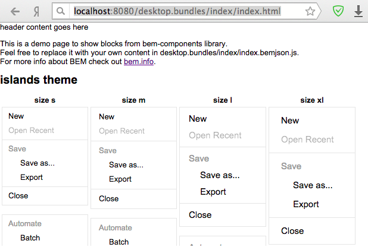

# Quick start for static page creation

This article describes step-by-step implementation of a static page using [BEM platform](https://en.bem.info/platform/).

## Expected outcome

A page that contains an input field, a button, and a greeting text. The value from the input field will be added to the greeting text when the user clicks the button.


## Preliminary steps

### Minimal requirements

* [Node.js 4+](https://nodejs.org/);
* [Git Bash](https://git-for-windows.github.io/) if you use Windows OS.

### A local copy and environment setting

A [template repository](https://github.com/bem/project-stub) is the quickest and easiest way to start your BEM project. It contains the minimal configuration files and folders.

**Note** If your operating system is Windows, you must run the following commands in Git Bash with administrator rights.

1.  Make a local copy of `project-stub`.

    **Note** Do not use root rights to install npm and bower dependencies. bower dependencies are installed in the `libs` directory by `npm postinstall`.

    ```bash
    git clone https://github.com/bem/project-stub.git --depth 1 start-project
    cd start-project
    npm install
    ```

2.  Run the server using [ENB](https://en.bem.info/toolbox/enb/):

    ```bash
    npm start
    ```

3.  Check the result on [http://localhost:8080/desktop.bundles/index/index.html](http://localhost:8080/desktop.bundles/index/index.html).

    A page with library blocks examples should open:

    

## Steps for creating the project

1.  [Create a page](#create-a-page)
  * [Describe the page in a BEMJSON file](#describe-the-page-in-a-bemjson-file)
2.  [Create a block](#create-a-block)
3.  [Implement the hello block](#implement-the-hello-block)
  * [Use JavaScript technology](#implement-the-hello-block-in-javascript-technology)
  * [Use BEMHTML technology](#implement-the-hello-block-in-bemhtml-technology)
  * [Use CSS technology](#implement-the-hello-block-in-css-technology)

When all steps have been completed you can watch the [result](#the-final-result).

### Create a page

Source code of pages is stored in the `start-project/desktop.bundles` directory. The main page `index` contains implementations of blocks for the [bem-components](https://en.bem.info/libs/bem-components/) library.

Create a new page to start your own project.

1.  Create the `hello` directory in the `desktop.bundles`.
2.  Add the `hello.bemjson.js` file to the `hello` directory.

#### Describe the page in a BEMJSON file

A [BEMJSON](https://en.bem.info/platform/bemjson/) file describes a page structure in BEM terms: blocks, elements and modifiers.

1.  Add a description of the `hello` block in the `desktop.bundles/hello/hello.bemjson.js` file. `hello` block is an entity that will contain all necessary elements for the project.

    ```js
    ({
        block : 'page',
        title : 'hello',
        head : [
            { elem : 'css', url : 'hello.min.css' }
        ],
        scripts : [{ elem : 'js', url : 'hello.min.js' }],
        mods : { theme : 'islands' },
        content : [
            {
                block : 'hello'
            }
        ]
    })
    ```

2.  Place the `greeting` element with the greeting text (`content` field) into the `hello` block.

    ```js
    content : [
        {
            block : 'hello',
            content : [
                {
                    elem : 'greeting',
                    content : 'Hello, %user%!'
                }
            ]
        }
    ]
    ```

3.  To create an input field and a button, use `input` and `button` blocks from the bem-components library. Add these blocks to the `hello` block`.

    ```js
    content : [
        {
            block : 'hello',
            content : [
                {
                    elem : 'greeting',
                    content : 'Hello, %user%!'
                },
                {
                    block : 'input',
                    mods : { theme : 'islands', size : 'm' },
                    name : 'name',
                    placeholder : 'User name'
                },
                {
                    block : 'button',
                    mods : { theme : 'islands', size : 'm', type : 'submit' },
                    text : 'Click'
                }
            ]
        }
    ]
    ```

[Code sample](https://gist.github.com/innabelaya/08405997f823d842e9e2) hello.bemjson.js.

To verify that the page shows all necessary objects, open [http://localhost:8080/desktop.bundles/hello/hello.html](http://localhost:8080/desktop.bundles/hello/hello.html).

### Create a block

In order for all objects on the page to work correctly, it is necessary to specify additional functionality of the `hello` block on your [redefinition level](https://en.bem.info/methodology/key-concepts/#redefinition-level).

1.  Create a directory of the `hello` block on the `desktop.blocks` level.
2.  Create the [implementation technology files](https://en.bem.info/methodology/key-concepts/#implementation-technology) (`CSS`, `JS`, `BEMHTML`) required by the block in the `hello` directory.
    The block directory name and its nested files must coincide with the block name specified in the BEMJSON file.

   * `hello.js` – describes dynamic page functionality.
   * `hello.bemhtml.js` – a template for generation of the block HTML representation.
   * `hello.css` – changes the design on the page.

### Implement the hello block

To implement the block in BEM terms, use the created technology files.

#### Implement the hello block in JavaScript technology

1.  Describe the block reaction to a user's action using the `onSetMod` property in the `desktop.blocks/hello/hello.js` file. A click on the button adds the user name from the input field to the greeting phrase.

    JavaScript code is written using [i-bem.js](https://en.bem.info/platform/i-bem/) declarative JavaScript framework.

    ```js
    onSetMod: {
        'js': {
            'inited': function() {
                this._input = this.findChildBlock(Input);

                this._domEvents().on('submit', function(e) {
                    e.preventDefault();

                    this._elem('greeting').domElem.text('Привет, ' +
                        this._input.getVal() + '!');
                });
            }
        }
    }
    ```

2.  To represent the current JavaScript code, use the [YModules](https://github.com/ymaps/modules/blob/master/README.md) modular system .

    ```js
    modules.define(
        'hello', // a block name
        ['i-bem-dom', 'input'], // dependence connection

        // a function that received names of the used modules
        function(provide, bemDom, Input) {
            provide(bemDom.declBlock('hello', { // a block declaration
                onSetMod: { // a constructor that describes reaction on an event
                    'js': {
                        'inited': function() {
                            this._input = this.findChildBlock(Input);

                            // the DOM-event that causes reaction
                            this._domEvents().on('submit', function(e) {
                                // prevention of event triggering by default:
                                // form data sending to the server with page reload
                                e.preventDefault();

                                this._elem('greeting').domElem.text('Hello, ' +
                                    this._input.getVal() + '!');
                            });
                        }
                    }
                }
            }));
        }
    );
    ```

#### Implement the hello block in BEMHTML technology

[BEMHTML](https://en.bem.info/platform/bem-xjst/) is a technology that processes BEMJSON declarations to create HTML layout of a web page.

1.  Write a [BEMHTML template](https://en.bem.info/platform/bem-xjst/templates-syntax/) and specify that the `hello` block has JavaScript implementation.
2.  Implement the `hello` block with form, adding `tag` mode.

    ```js
    block('hello')(
        js()(true),
        tag()('form')
    );
    ```

#### Implement the hello block in CSS technology

1.  Create your own CSS rules for the `hello` block. For example:

    ```css
    .hello
    {
        color: green;
        padding: 10%;
    }

    .hello__greeting
    {
        margin-bottom: 12px;
    }

    .hello__input
    {
        margin-right: 12px;
    }
    ```

2.  To add to `input` block the CSS rules that are already implemented in the `input` element of `hello` block, mix element using the field `mix` in the input data (BEMJSON).

    ```js
    {
        block : 'input',
        mods : { theme : 'islands', size : 'm' },

        // mix element to add CSS rules
        mix : { block : 'hello', elem : 'input' },

        name : 'name',
        placeholder : 'User name'
    }
    ```

[Code sample](https://gist.github.com/innabelaya/e15b6b11dbe68dd9be73) hello.bemjson.js.

## The final result

To see the result of the project, please refresh the page: [http://localhost:8080/desktop.bundles/hello/hello.html](http://localhost:8080/desktop.bundles/hello/hello.html)

Since the project consists only of one page, there is no need for a full build. Description of a more complex project is in [Starting your own project](https://en.bem.info/platform/tutorials/start-with-project-stub/) article.
