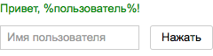
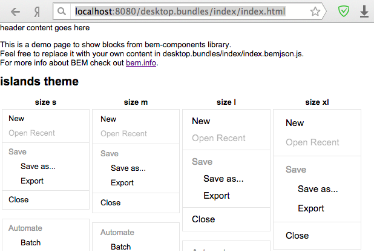

# Быстрый старт по созданию статической страницы

В этой статье рассмотрен пример реализации статической страницы на [БЭМ-платформе](https://ru.bem.info/platform/).

## Что должно получиться

Страница приветствия пользователя, содержащая поле ввода, кнопку и текст. При нажатии на кнопку страница обновляется и текст дополняется значением, введенным в поле.



## С чего начать

### Минимальные требования

* [Node.js 4+](https://nodejs.org/);
* [Git Bash](https://git-for-windows.github.io/) — для пользователей операционной системы Windows.

### Локальная копия и настройка окружения

Для быстрого и простого создания БЭМ-проекта потребуется [шаблонный репозиторий](https://github.com/bem/project-stub), содержащий необходимый минимум конфигурационных файлов и папок.

**Важно** Пользователям Windows необходимо выполнять все команды в Git Bash. Убедитесь, что Git Bash запущен от имени администратора.

1.  Сделайте локальную копию `project-stub`.

    **Важно** Не используйте права суперпользователя (`root`) при установке npm- и bower-зависимостей. bower-зависимости ставятся при выполнении `npm postinstall` в папку `libs`.

    ```bash
    git clone https://github.com/bem/project-stub.git --depth 1 start-project
    cd start-project
    npm install
    ```

2.  Запустите сервер с помощью [ENB](https://ru.bem.info/toolbox/enb/):

    ```bash
    npm start
    ```

3.  Проверьте результат по ссылке [http://localhost:8080/desktop.bundles/index/index.html](http://localhost:8080/desktop.bundles/index/index.html).

    Должна открыться страница с примерами блоков библиотеки:

    

## Пошаговая инструкция по созданию проекта

Процедура разработки страницы приветствия состоит из следующих этапов:

1.  [Создание страницы](#Создание-страницы)
  * [Описание страницы в BEMJSON-файле](#Описание-страницы-в-bemjson-файле)
2.  [Создание блока](#Создание-блока)
3.  [Реализация блока hello](#Реализация-блока-hello)
  * [В технологии JavaScript](#Реализация-блока-в-технологии-javascript)
  * [В технологии BEMHTML](#Реализация-блока-в-технологии-bemhtml)
  * [В технологии CSS](#Реализация-блока-в-технологии-css)

После выполнения всех шагов можно смотреть [результат](#Результат).

### Создание страницы

Исходники страниц размещаются в каталоге `start-project/desktop.bundles`. Изначально в проекте присутствует главная страница `index` с примерами блоков библиотеки [bem-components](https://ru.bem.info/libs/bem-components/).

Для начала работы с собственным проектом создайте новую страницу.

1.  Разместите в `desktop.bundles` каталог с именем `hello`.
2.  Добавьте в него файл `hello.bemjson.js`.

#### Описание страницы в BEMJSON-файле

[BEMJSON](https://ru.bem.info/platform/bemjson/) — это структура страницы, описанная в терминах блоков, элементов и модификаторов.

1.  Добавьте на своем проекте описание блока `hello` в файле `desktop.bundles/hello/hello.bemjson.js`. Блок `hello` — это сущность, которая содержит в себе все необходимые для проекта элементы.

    ```js
    ({
        block : 'page',
        title : 'hello',
        head : [
            { elem : 'css', url : 'hello.min.css' }
        ],
        scripts : [{ elem : 'js', url : 'hello.min.js' }],
        mods : { theme : 'islands' },
        content : [
            {
                block : 'hello'
            }
        ]
    })
    ```

2.  Поместите элемент `greeting` с текстом приветствия пользователя (поле `content`) в блок `hello`.

    ```js
    content : [
        {
            block : 'hello',
            content : [
                {
                    elem : 'greeting',
                    content : 'Привет, %пользователь%!'
                }
            ]
        }
    ]
    ```

3.  Чтобы создать поле ввода и кнопку, возьмите готовые реализации блоков `input` и `button` из библиотеки bem-components и добавьте их в блок `hello`.

    ```js
    content : [
        {
            block : 'hello',
            content : [
                {
                    elem : 'greeting',
                    content : 'Привет, %пользователь%!'
                },
                {
                    block : 'input',
                    mods : { theme: 'islands', size : 'm' },
                    name : 'name',
                    placeholder : 'Имя пользователя'
                },
                {
                    block : 'button',
                    mods : { theme : 'islands', size : 'm', type : 'submit' },
                    text : 'Нажать'
                }
            ]
        }
    ]
    ```

[Полный код](https://gist.github.com/innabelaya/837a96299de6fd488223) BEMJSON-файла.

Чтобы убедиться, что страница отображает все необходимые объекты, откройте [http://localhost:8080/desktop.bundles/hello/hello.html](http://localhost:8080/desktop.bundles/hello/hello.html).

### Создание блока

Чтобы элементы на странице работали должным образом, необходимо прописать дополнительную функциональность блока `hello` на своем [уровне переопределения](https://ru.bem.info/methodology/key-concepts/#Уровень-переопределения).

1.  Создайте вручную каталог блока `hello` на уровне `desktop.blocks`.
2.  Разместите в нем необходимые для проекта [файлы технологий реализации блока](https://ru.bem.info/methodology/key-concepts/#Технология-реализации) (`CSS`, `JS`, `BEMHTML`). Название каталога блока и вложенных в него файлов должны совпадать с именем блока, которое прописано в BEMJSON-файле.

    * `hello.js` — описывает динамическую функциональность страниц;
    * `hello.bemhtml.js` — шаблоны для генерации HTML-представления блока;
    * `hello.css` — изменяет внешний вид объектов на странице.

### Реализация блока hello

Для представления блока в терминах БЭМ необходимо реализовать его в следующих технологиях.

#### Реализация блока в технологии JavaScript

1.  Опишите в файле `desktop.blocks/hello/hello.js` реакцию блока на действие пользователя с помощью специального свойства `onSetMod`. При нажатии кнопки в текст приветствия будет подставляться имя пользователя, введенное в поле `input`.

    JavaScript-код написан с использованием декларативного JavaScript-фреймворка — [i-bem.js](https://ru.bem.info/platform/i-bem/).

    ```js
    onSetMod: {
        'js': {
            'inited': function() {
                this._input = this.findChildBlock(Input);
                
                this._domEvents().on('submit', function(e) {
                	e.preventDefault();
                    
                    this._elem('greeting').domElem.text('Привет, ' +
                    	this._input.getVal() + '!');
                });
            }
        }
    }
    ```

2.  Используйте модульную систему [YModules](https://github.com/ymaps/modules/blob/master/README.ru.md), чтобы представить данный JavaScript-код:

    ```js
    modules.define(
        'hello', // имя блока
        ['i-bem-dom', 'input'], // подключение зависимости

        // функция, в которую передаются имена используемых модулей
        function(provide, bemDom, Input) {
            provide(bemDom.declBlock('hello', { // декларация блока
                onSetMod: { // конструктор для описания реакции на события
                    'js': {
                        'inited': function() {
                            this._input = this.findChildBlock(Input);

                            // DOM-событие, на которое будет реакция
                            this._domEvents('submit', function(e) {
                                // предотвращение срабатывания события по умолчанию:
                                // отправка формы на сервер с перезагрузкой страницы
                                e.preventDefault();

                                this._elem('greeting').domElem.text('Привет, ' +
                                	this._input.getVal() + '!');
                            });
                        }
                    }
                }
            }));
        });
    ```

#### Реализация блока в технологии BEMHTML

[BEMHTML](https://ru.bem.info/platform/bem-xjst/) — технология, которая преобразует входные данные из BEMJSON-файла в HTML.

1.  Напишите [BEMHTML-шаблон](https://ru.bem.info/platform/bem-xjst/templates-syntax/) и укажите в нем, что блок `hello` имеет JavaScript-реализацию.
2.  Оберните блок `hello` в форму, добавив моду `tag`.

    ```js
    block('hello')(
        js()(true),
        tag()('form')
    );
    ```

#### Реализация блока в технологии CSS

1.  Для блока `hello` создайте свои CSS-правила. Например, такие:

    ```css
    .hello
    {
        color: green;
        padding: 10%;
    }

    .hello__greeting
    {
        margin-bottom: 12px;
    }

    .hello__input
    {
        margin-right: 12px;
    }
    ```

2.  Для добавления к блоку `input` CSS правил, уже реализованных в элементе `input` блока `hello`, подмешайте элемент с помощью поля `mix` во входных данных (BEMJSON).

    ```js
    {
        block : 'input',
        mods : { theme : 'islands', size : 'm' },

        // подмешиваем элемент для добавления CSS-правил
        mix : { block : 'hello', elem : 'input' },

        name : 'name',
        placeholder : 'Имя пользователя'
    }
    ```

[Полный код](https://gist.github.com/innabelaya/045ddfb063af3b262182) BEMJSON-файла.

## Результат

Чтобы увидеть итог проделанной работы, обновите страницу:

[http://localhost:8080/desktop.bundles/hello/hello.html](http://localhost:8080/desktop.bundles/hello/hello.html)

Поскольку проект состоял всего из одной страницы, то необходимость в полной сборке отсутствует. О том, как написать более сложный проект, читайте в статье [Создаем свой проект на БЭМ](https://ru.bem.info/platform/tutorials/start-with-project-stub/).
