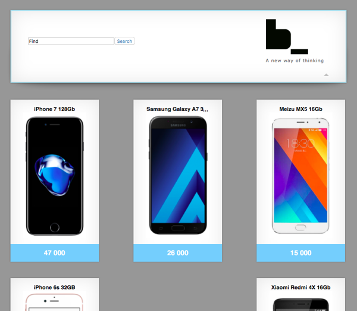
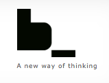
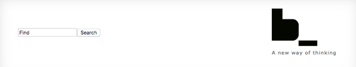
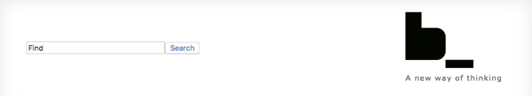
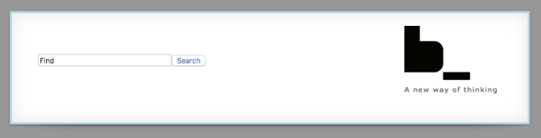
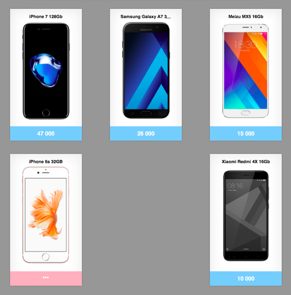
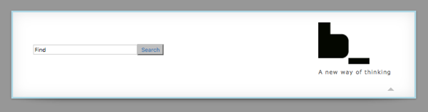

# Starting your own BEM project

Within this tutorial we are going to develop a project using [BEM platform](https://ru.bem.info/platform/). This tutorial requires JavaScript programming language knowledge.

We will create an [online shop web page](http://varya.me/online-shop-dummy/desktop.bundles/index/index.html) using BEM principles in CSS-writing, JavaScript, [i-bem.js](https://en.bem.info/platform/i-bem/) and [BEMHTML](https://en.bem.info/platform/bem-xjst/).



## Setting up the environment

All tools that we are going to use work crossplatform.

Be aware that you use suitable versions of BEM tools and libraries to run through this tutorial:
* [enb v1.3.0](https://en.bem.info/toolbox/enb/)
* [bem-core v2.8.0](https://en.bem.info/libs/bem-core/v2.8.0/)

To get started with BEM-based project you need to install:

* [Node.js 0.12+](http://nodejs.org/).
* [Git Bash](https://git-for-windows.github.io/) if you use Windows OS.

## Starting with a new project repository

The quickest and easiest way to start with your own BEM project is to use an existing template project repository — [project-stub](https://github.com/bem/project-stub). It contains the minimal configuration files and folders you will need for quick start from scratch.

We need to create a local copy of a `project-stub`. You can choose any of your favorite tools to clone the project. We are going to use Git.

If your operating system is Windows, you must run the following commands in Git Bash with administrator rights. Make sure that you launch Git Bash as an administrator.

```bash
git clone https://github.com/bem/project-stub.git --depth 1 --branch v1.6.0 test-project
```

Go to a new project directory:

```bash
cd test-project
```

Remove the versions history of the origin:

```bash
rm -rf .git
```

Create a git repository from that directory:

```bash
git init
```

Install all dependencies:

**Note** Do not use `root` rights to install npm and bower dependencies. bower dependencies are installed in the `libs` directory by `npm postinstall`.

```bash
npm install
```

Build the project using [ENB](https://en.bem.info/toolbox/enb/):

```bash
./node_modules/.bin/enb make
```

Project build process configuration is determined in `.enb/make.js` file. It defines all the technologies of blocks implementation (templates, dependencies, CSS rules and JavaScript functionality) that have to be connected to the project pages by ENB.

Run a server mode for development:

```bash
./node_modules/.bin/enb server
```

As a result, the following message appears:

`Server started at 0.0.0.0:8080`

This means that the ENB server is up and running. From this point on a solicited part of your project will be rebuilt automatically every time you reload a web page. The result is available on [http://localhost:8080/desktop.bundles/index/index.html](http://localhost:8080/desktop.bundles/index/index.html).

**Getting stuck?**

If port:8080 is already in use by another program, you can redefine it using `-p` option.

```bash
./node_modules/.bin/enb server -p portNum
```

## Brief overview of the project structure

HTML layout and CSS rules of each page depend on its [BEMJSON](https://en.bem.info/platform/bemjson/) description in a `pageName.bemjson.js` file. In BEM terms it is called [declaration](https://en.bem.info/methodology/declarations/).

A BEMJSON declaration describes a page structure in BEM terms: blocks, elements and modifiers. [BEMHTML template engine](https://en.bem.info/platform/bem-xjst/) processes BEMJSON declaration to create HTML layout of a web page. BEMJSON file describes the web page as a [BEM tree](https://en.bem.info/methodology/key-concepts/#bem-tree) that [provides all dependencies](https://en.bem.info/methodology/build/) for creation of technology bundles.

Blocks are our building materials for each page. You can use the already created blocks from the [libraries](https://en.bem.info/libs/) or create a new one by yourself.

Every block can be implemented in the following technologies: `css`/`styl`, `js`, `bemhtml.js`, `deps.js`, `bemjson.js`. We will call them [block implementation technology files](https://en.bem.info/methodology/key-concepts/#implementation-technology). Blocks implementation sets are stored in one directory. In BEM terms it is called [redefinition level](https://en.bem.info/methodology/key-concepts/#redefinition-level).

[Project structure](https://en.bem.info/methodology/filesystem/) presumes that all newly created and redefined blocks are stored in a `desktop.blocks` directory. The web pages blocks and all blocks that are mentioned in BEMJSON declarations are stored in a `desktop.bundles` directory.

## Step-by-step

This section provides you with a step-by-step diving into BEM-based development of a web page. Previewing the steps of this tutorial will give you a clear insight into the developing process.

First of all the two main parts of our web page will be defined: a head and its main part — body.

1. We will create a head section on the page. In BEM terms we will call it a `head` block. We will [declare the `head` block in a BEMJSON](#declaring-a-block-in-bemjson) file of a page, [create it and assign the first CSS rules](#creating-a-new-block) to provide a correct markup within this block.

2. The `head` block will be extended by a search form and a logo, created [using blocks from the library](#using-a-block-library). A `logo` block will be rendered as a link to bem.info site. Using CSS and BEMHTML technologies we will [redefine some blocks from a library](#modifying-the-library-blocks).

3. A list of goods will be added to a page body using [corresponding BEMHTML template](#bemhtml-templates). We will declare it in BEMJSON as a `goods` block. New CSS rules for this block will provide correct layout for a list of goods.

4. For correct appliance of CSS rules and JavaScript implementation of a block we will [provide additional dependencies](#blocks-dependencies) in a `deps.js` file.

5. We will [link a third-party library](#using-a-third-party-library) to the project and [extend JavaScript functionality of the block](#declarative-javascript) we are going to use.

6. We will find out how to extend the block functionality using a [mix of blocks and elements](#mix-of-blocks-and-elements).

7. And finally we will show you [how to create a new page](#creating-a-new-page) and start a whole [project build procedure](#starting-building-the-project).

## Changing pages

You have just one page in your project to begin with: index.html. Try and open it in your browser: [http://localhost:8080/desktop.bundles/index/index.html](http://localhost:8080/desktop.bundles/index/index.html).

Initially index.html page contains sample blocks which demonstrate the diversity of the [bem-components](https://en.bem.info/libs/bem-components/) libraries, connected to the project-stub.

**Note!** Make sure that you specify the full path to the index.html page. Otherwise some problems with relative paths could occur and all CSS rules will be ignored.

### Declaring a block in BEMJSON

Let's add a `head` block to the page. To do this declare it in a BEMJSON file of a page.

```js
{ block: 'head' }
```

```js
module.exports = {
    block: 'page',
    title: 'Title of the page',
    favicon: '/favicon.ico',
    head: [
        { elem: 'meta', attrs: { name: 'description', content: '' }},
        { elem: 'css', url: 'index.min.css' }
    ],
    scripts: [{ elem: 'js', url: 'index.min.js' }],
    content: [
        { block : 'head'}
    ]
};
```

Refresh the page to see the corresponding `<div>` with a `head` class.

```html
<!DOCTYPE html>
<html class="ua_js_yes">
    <head>...</head>

    <body class="page">
        <div class="head"></div>

        <script src="index.min.js"></script>
    </body>
</html>
```

A `head` block consists of a search form, a logo and a layout block that provides correct markup within the head.

First of all put a `layout` block along with its two elements (`left` and `right`) inside the `head` block.

```js
{
    block: 'head',
    content: {
        block: 'layout',
        content: [
            {
                elem: 'left',
                content: 'left here'
            },
            {
                elem: 'right',
                content: 'right here'
            }
        ]
    }
}
```
[Code sample](https://gist.github.com/tadatuta/fcc6b7bd8523d453d0fd) index.bemjson.js.

Refresh the page to view the new corresponding HTML layout.

```html
<!DOCTYPE html>
<html class="ua_js_yes">
    <head>...</head>

    <body class="page">
        <div class="head">
            <div class="layout">
                <div class="layout__left">left here</div>
                <div class="layout__right">right here</div>
            </div>
        </div>

        <script src="index.min.js"></script>
    </body>
</html>
```

This markup requires CSS rules for the `layout`. In BEM terms you have to [implement a block in CSS](https://en.bem.info/methodology/key-concepts/#implementation-technology).

**Note** [Stylus](http://stylus-lang.com/) — CSS preprocessor based on JavaScript — is linked to the `project-stub` by default. Thus you can create CSS rules both in `.css` and `.styl` formats.

### Creating a new block

To implement a block using CSS technology you have to create a CSS file for this block in a corresponding block directory using `bem create` command of [bem-tools](https://github.com/bem/bem-tools/blob/dev/docs/commands/commands.en.md).

```bash
bem create -l desktop.blocks -b layout -T css
```

where

* `-l directoryName` — defines a redefinition level;
*  `-b blockName` — defines a name of the block directory for which a technology file will be created. If there is no any directory with the defined name, creates it;
* `-T technologyName` — creates technology file for block implementation.

Running this command creates a `desktop.blocks/layout/layout.css` file in a `layout` directory on a `desktop.blocks` redefinition level. Inside you will find a CSS selector that matches the layout block.

It is where you step in and fill the selector up with CSS properties.
Or just copy and paste from [Gist](https://gist.github.com/innabelaya/8906070).

You can create the blocks manually. To do so just create a `desktop.blocks/layout` directory and put there all required block implementation technology files.

A `logo` block will consist of an icon with a slogan. To insert it into the `head` block we have to declare a logo in an `index.bemjson.js` file and add CSS rules for it.

You can use our [cute BEM image](http://varya.me/online-shop-dummy/desktop.blocks/b-logo/b-logo.png) for the logo or pick any other image you like.

```js
{
    elem: 'right',
    content: {
        block: 'logo',
        content: [{
            block: 'image',
            attrs: {
                src: '//varya.me/online-shop-dummy/desktop.blocks/b-logo/b-logo.png'
            }
        },
        {
            elem: 'slogan',
            content: 'A new way of thinking'
        }]
    }
}
```

[Code sample](https://gist.github.com/tadatuta/4b4175f7eaa0a8113365) index.bemjson.js.



### Using a block library

You do not need to implement an `input` and a `button` blocks yourself. They are provided by the [bem-components library](https://en.bem.info/libs/bem-components/) which is linked to the project-stub by default. So you can just declare these blocks in a `desktop.bundles/index/index.bemjson.js` file.

```js
{
    elem: 'left',
    content: [
        {
            block: 'input',
            name: 'text',
            val: 'Find'
        },
        {
            block: 'button',
            mods: { type: 'submit' },
            content: 'Search'
        }
    ]
}
```

[Code sample](https://gist.github.com/godfreyd/7da95e41ed257bf1e5a4f63247c25925) index.bemjson.js.

Let's add Yandex search results to the search form:

```js
{
    elem: 'left',
    content: {
        tag: 'form',
        attrs: { action: 'https://yandex.com/yandsearch' },
        content: [
            {
                block: 'input',
                name: 'text',
                val: 'Find'
            },
            {
                block: 'button',
                mods: { type: 'submit' },
                content: 'Search'
            }
        ]
    }
}
```

[Code sample](https://gist.github.com/godfreyd/3d862f3e6ff2eb5221498cdfe7bc9351) index.bemjson.js.



Use a `link` block from the same library to render an icon with a slogan as a link to [bem.info](https://en.bem.info/) site.


```js
{
    elem: 'right',
    content: {
        block: 'logo',
        content: [
            {
                block: 'link',
                url: 'https://en.bem.info',
                content: [
                    {
                        block: 'image',
                        attrs: { src: 'http://varya.me/online-shop-dummy/desktop.blocks/b-logo/b-logo.png' }
                    },
                    {
                        elem: 'slogan',
                        content: 'A new way of thinking'
                    }
                ]
            }
        ]
    }
}
```

[Code sample](https://gist.github.com/godfreyd/ed8a8e811a9f3d83950aff6116990fd6) index.bemjson.js.

### Modifying the library blocks

#### Modifying a block in CSS

The blocks `input` and `button` can be modified using additional CSS rules.

The CSS files for an `input` block have to be stored in a `desktop.blocks` redefinition level:

```bash
bem create -l desktop.blocks -b input -T css
```

[Code sample](https://gist.github.com/innabelaya/8906605) input.css.

Run the same command for a `button` block:

```bash
bem create -l desktop.blocks -b button -T css
```

[Code sample](https://gist.github.com/innabelaya/8906646) button.css.

The same can be done for a `link` block.

```bash
bem create -l desktop.blocks -b link -T css
```

[Code sample](https://gist.github.com/innabelaya/8906451) link.css.



#### Modifying BEMHTML

You need an additional HTML element — a container — to center the page. It is not necessary to create a specific block for it. The more correct way rather be to modify a `page` block template at a `desktop.blocks` redefinition level. This template will generate an output HTML for the entire page.

We are going to use [BEMHTML](https://en.bem.info/platform/bem-xjst/) as a template language.

```bash
bem create -l desktop.blocks -b page -T bemhtml.js
```

You can use BEMHTML templates not only to declare HTML tags to output but also to generate additional markup depending on view.

Add some code to wrap the page contents in additional container node; put it into a newly created `desktop.blocks/page/page.bemhtml.js` file.

```js
block('page')(
    content()(function() {
        return {
            elem: 'inner',
            content: applyNext()
        };
    })
);
```

[Code sample](https://gist.github.com/innabelaya/8906664) page.bemhtml.js.

```html
<!DOCTYPE html>
<html class="ua_js_yes">
    <head>...</head>

    <body class="page">
        <div class="page__inner">
            <div class="head">
                <div class="layout">...</div>
            </div>

            <script src="index.min.js"></script>
        </div>
    </body>
</html>
```

Then implement the `page` block in CSS technology to apply style to resulting markup:

```bash
bem create -l desktop.blocks -b page -T css
```

Copy CSS code for a newborn `desktop.blocks/page/page.css` file from [here](https://gist.github.com/innabelaya/8906698).

Define a border property for the head to make it visible on a page. To do this create CSS rules fir the `head` block.

```bash
bem create -l desktop.blocks -b head -T css
```

Once again, you can borrow contents for a `desktop.blocks/head/head.css` file from [here](https://gist.github.com/innabelaya/8906724).


## BEMHTML templates

A web page we are going to develop contains a list of some goods. To be able to add it to the page you have to declare a `goods` block in a BEMJSOM file. There are the following goods data available: title, image, price and link for each item.

```js
{
    block: 'goods',
    goods: [
        {
            title: 'Apple iPhone 4S 32Gb',
            image: 'https://mdata.yandex.net/i?path=b1004232748_img_id8368283111385023010.jpg',
            price: '259',
            url: '/'
        },
        {
            title: 'Samsung Galaxy Ace S5830',
            image: 'https://mdata.yandex.net/i?path=b0206005907_img_id5777488190397681906.jpg',
            price: '73',
            url: '/'
        },
        //...
}
```

[Code sample](https://gist.github.com/godfreyd/357ea81bdd3cbeb86d1c64ca05cfc1a7) index.bemjson.js.

This block has to be implemented in BEMHTML technology in order to be turned into an appropriate piece of HTML. It needs to be styled with CSS as well. So you can create this block with two types of technologies at once using `bem create` command:

```bash
bem create -l desktop.blocks -b goods -T bemhtml.js -T css
```

Then write BEMHTML code in a `desktop.blocks/goods/goods.bemhtml.js` file that processes BEMJSON input data into the block elements. Use a `tag` mode to define an HTML representation of a goods block and its elements as well.

```js
block('goods')(
    tag()('ul'),

    //...

    elem('item')(
        tag()('li')
    ),

    elem('title')(
       tag()('h3')
    ),

    elem('image')(
       tag()('img'),

        attrs()(function() {
            return { src: this.ctx.url };
        })
    ),

    elem('price')(
       tag()('span')
    )
);
```

[Code sample](https://gist.github.com/innabelaya/8913843) goods.bemhtml.js.

```html
<!DOCTYPE html>
<html class="ua_js_yes">
    <head>...</head>

    <body class="page">
        <div class="page__inner">
            <div class="head">...</div>

            <ul class="goods">
                <li class="goods__item">
                    <h3 class="goods__title">Apple iPhone 4S 32Gb</h3>
                    
                    <span class="goods__price">259</span>
                </li>
                <li class="goods__item">...</li>
                <li class="goods__item">...</li>
            </ul>

            <script src="index.min.js"></script>
        </div>
    </body>
</html>
```

Templates can produce not only HTML elements of a block but nested blocks as well. The example below shows you how to render a price element as a `link` block of [bem-components](https://en.bem.info/libs/bem-components/3.0.0/desktop/link/) library.

An extra trick: if you would like to avoid cascade when styling the block, mark this link as an element of a `goods` block.

```js
{
    elem: 'price',
    content: {
        block: 'link',
        mix: [{ block: 'goods', elem: 'link' }],
        url: item.url,
        content: item.price
    }
}
```

[Code sample](https://gist.github.com/innabelaya/8913983) goods.bemhtml.js.

```js
<ul class="goods">
    <li class="goods__item">
        <h3 class="goods__title">Apple iPhone 4S 32Gb</h3>

        

        <span class="goods__price">
            <a class="link goods__link" href="/">259</a>
        </span>
    </li>
    //...
    <li class="goods__item">...</li>
    <li class="goods__item">...</li>
</ul>
```

You need to identify new goods on a page. To implement this add a verification of a `new` modifier to the template: [code sample](https://gist.github.com/innabelaya/8914048).

Use this code snapshot for [CSS rules](https://gist.github.com/innabelaya/8915049).

Notice that you do not need to create CSS file for this block because it had already been generated by `bem create`.


## Blocks dependencies

Besides declaring blocks within input BEMJSON data you need to make sure that the corresponding templates, CSS and JavaScript are linked to the page. To do this, describe block dependencies.

BEM provides a special `deps.js` block technology for this.

```bash
bem create -l desktop.blocks -b goods -T deps.js
```

The `link` block is declared in BEMHTML, not in BEMJSON, so you need to add dependencies of the `link` block to the `goods`.

You can use moderate dependency type codenamed `shouldDeps` and declare that you need a `link` block.

```js
({
    shouldDeps: [
        'link'
    ]
})
```

[Code sample](https://gist.github.com/innabelaya/8915140) goods.deps.js.

## Using a third-party library

It would be nice to have each item in the list of goods rendered as a rectangle with a shadow. We can borrow a block from a third-party block library called `j`.

It provides just one block `box` that does all we need.

You should declare a library name, its version (if available) and its repository URL in a `bower.json` file.

```js
"dependencies": {
  "bem-components": "3.0.0",
  "j": "git://github.com/innabelaya/j.git#695d479fbdd7c97e61bd89953ef095e2e567e70e"
}
```

[Code sample](https://gist.github.com/tadatuta/ce9a013691c91adebec0) bower.json.

Install a new library. For this run the following command:

```bash
./node_modules/.bin/bower i
```

Next make your pages take blocks from the block level provided by the library . Do this by tuning a bundle configuration in a `.enb/make.js` file:

```js
levels = [
    { path: 'libs/bem-core/common.blocks', check: false },
    { path: 'libs/bem-core/desktop.blocks', check: false },
    { path: 'libs/bem-components/common.blocks', check: false },
    { path: 'libs/bem-components/desktop.blocks', check: false },
    { path: 'libs/bem-components/design/common.blocks', check: false },
    { path: 'libs/bem-components/design/desktop.blocks', check: false },
    { path: 'libs/j/blocks', check: false },
    'common.blocks',
    'desktop.blocks'
];
```

[Code sample](https://gist.github.com/tadatuta/3d91a444180b23443b7e) .enb/make.js.

You need to restart the server after changing the configuration to apply all changes. Kill the current process (`Ctrl+C`) and run the server again.

## Mix of blocks and elements

Having linked the library you can use a `box` block. We will use it to add a white background with a shadow to the head of the page.  To do this, you need to mix the `head` block with the `box` block, and declare this `mix` method in BEMJSON.

One of the possible ways to mix blocks is to declare this `mix` in BEMJSON input data.

Here you can mix `head` and `box` blocks:

```js
{
    block: 'head',
    mix: [{ block: 'box' }],
    content: ...
}
```

[Code sample](https://gist.github.com/godfreyd/bcd05232adf5f3a06de7ccc9ea05f337) index.bemjson.js.

```html
<!DOCTYPE html>
<html class="ua_js_yes">
    <head>...</head>

    <body class="page">
        <div class="page__inner">
            <div class="head box">
                <div class="layout">...</div>
            </div>

            <ul class="goods">...</ul>

            <script src="index.min.js"></script>
        </div>
    </body>
</html>
```



You can also mix an element with a block. Mix could be declared in BEMJSON or in BEMHTML templates of a block.

Let's specify that each item element from a goods list has the same formatting as a head of the page. For this you need to mix each `item` from the `goods` block with the `box` block from the already linked library.

```js
elem: 'item',
    elemMods: { new: item.new ? 'yes' : undefined },
    mix: [{ block: 'box' }],
    content: ...
```

[Code sample](https://gist.github.com/innabelaya/8930835) goods.bemhtml.js.

```html
<!DOCTYPE html>
<html class="i-ua_js_yes">
    <head>...</head>

    <body class="page">
        <div class="page__inner">
            <div class="head box">...</div>

            <ul class="goods">
                <li class="goods__item box">...</li>
                <li class="goods__item box">...</li>
                <li class="goods__item box">...</li>
                <li class="goods__item goods__item_new_yes box">...</li>
                <li class="goods__item box">...</li>
                //...
            </ul>

            <script src="index.min.js"></script>
        </div>
    </body>
</html>
```

Do not forget to define that a `goods` block requires the `box` block.

```js
({
    shouldDeps: [
        'link',
        'box'
    ]
})
```

[Code sample](https://gist.github.com/innabelaya/8930709) goods.deps.js.



## Declarative JavaScript

### JavaScript for a block

The `box` block borrowed from a third-party library supports roll up animation implemented in JavaScript.

To use this functionality in a `head` block you need to change the a block BEMJSON declaration and set JavaScript property to `true` for the mixed `box` block.

    mix: [{ block: 'box', js: true }]

[Code sample](https://gist.github.com/godfreyd/1fe1aa79ccb602e50e1484dbc98f6e12) index.bemjson.js.

It is required to have a `switcher` element in the block:

```js
block: 'head',
mix: [{ block: 'box', js: true }],
content: [
    {
        block: 'layout',
        //...
    },
    {
        block: 'box',
        elem: 'switcher'
    }
]
```

[Code sample](https://gist.github.com/godfreyd/f4e8e10349bc1de79eda1a2f63aeb9aa) index.bemjson.js.

With that you have a block with a clickable arrow-shaped element which rolls the block up in the `head` block.



### Modifying JavaScript

If you are not satisfied with the dynamic functionality provided by the `box` block, you could change it. Maybe you would like it to roll up and left. Usually you cannot alter the code of the library you borrowed your block from as it is not yours. But thanks to using the [i-bem.js](https://en.bem.info/platform/i-bem/) declarative framework you can change JavaScript implementation of a block.

```bash
bem create -l desktop.blocks -b box -T js
```

You need to use the `onSetMod` property in a `desktop.blocks/box/box.js` file to specify a block reaction depending on modifier state change.

In this example the block is told to respond to setting up and removing a `closed` modifier:

```js
onSetMod : {

    'closed': {
        'yes': function() {
            // some functionality here
        },

        '': function() {
            // some functionality here
        }
    }

}
```

[Code sample](https://gist.github.com/innabelaya/9503213) box.js.

## Creating a new page

In a BEM world a page is also a block but at the `desktop.bundles` redefinition level. So you can use `bem create` command for pages as well.

Create a new page of the project called `contact`:

```bash
bem create -l desktop.bundles -b contact
```

As you can see there is no `-T` flag here, because `bem create` creates the `desktop.bundles` block level implementation in BEMJSON technology by default. As a result in a `desktop.bundles/contact/contact.bemjson.js` file being filled with dummy page contents.

Load a new page in a browser: [http://localhost:8080/desktop.bundles/contact/contact.html](http://localhost:8080/desktop.bundles/contact/contact.html).

Server builds it for us upon the first access.

## Starting building the project

While developing every time you reload a page in a browser the server rebuilds what has to be rebuilt following your changes.

To rebuild the entire project you can use the following ENB command:

```bash
node_modules/.bin/enb make
```

## Key take-aways

This tutorial just lets us to open a door to the BEM world.

So, in this article, we learned how to quickly and easily get started with your own project, deployed from templates repository project-stub.

Based on the BEM principles we got to know how to create new blocks and use the existing one from the libraries, how to change blocks functionality, styles and templates.

We started use some of the BEM tools, in particular the `ENB`. We found out how to start working with the BEMHTML template engine and the `i-bem.js` declarative framework.
