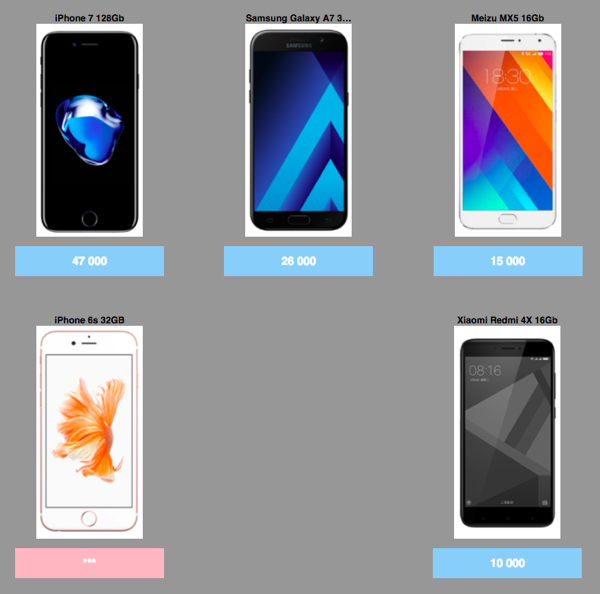

# Создаем статический БЭМ-проект

Эта статья рассказывает о том, как быстро создать свой проект с использованием [БЭМ-платформы](https://ru.bem.info/platform/). Для изучения материала, представленного в статье, необходимо знание JavaScript.

Мы шаг за шагом создадим [страничку каталога товаров](http://varya.me/online-shop-dummy/desktop.bundles/index/index.html), пользуясь принципами БЭМ в CSS, возможностью писать декларативный JavaScript с использованием фреймворка [i-bem.js](https://ru.bem.info/platform/i-bem/) и шаблонизатора [BEMHTML](https://ru.bem.info/platform/bem-xjst/).


## Настройка окружения

Инструменты, которые мы собираемся использовать, кроссплатформенны.

Обратите внимание на актуальность версий инструментов и библиотек:
* [enb v1.3.0](https://ru.bem.info/toolbox/enb/)
* [bem-core v4.1.1](https://en.bem.info/libs/bem-core/v4.1.1/)

Для начала работы с любым БЭМ-проектом вам необходимо установить:

* [Node.js 4+](http://nodejs.org/);
* [Git Bash](https://git-for-windows.github.io/) — для пользователей операционной системы Windows.

## Создание собственного репозитория проекта

Самый оптимальный путь создания собственного проекта — использование шаблонного репозитория [project-stub](https://github.com/bem/project-stub). Он содержит необходимый минимум конфигурационных файлов и папок и позволяет быстро развернуть проект.

Нам понадобится локальная копия `project-stub`. Её можно сделать любым удобным для вас способом. Мы будем использовать Git.

**Важно** Пользователям Windows необходимо выполнять все команды в Git Bash. Убедитесь, что Git Bash запущен от имени администратора.

```bash
git clone https://github.com/bem/project-stub.git --depth 1 test-project
```

Переходим в директорию нашего проекта:

```bash
cd test-project
```

Удаляем всю историю версионирования исходного репозитория:

```bash
rm -rf .git
```

Инициализируем собственный репозиторий в директории проекта:

```bash
git init
```

Устанавливаем зависимости:

**Важно** Не используйте права суперпользователя (`root`) при установке npm-зависимостей.

```bash
npm install
```

Собираем проект с помощью [ENB](https://ru.bem.info/toolbox/enb/):

```bash
npm run build
```

Конфигурация процесса сборки хранится в файле `.enb/make.js`. На её основе `ENB` подключает все технологии, которые составляют реализацию блоков: шаблоны, зависимости, CSS-правила и JavaScript-функциональность.

Для удобства разработки запускаем сервер:

```bash
npm start
```

В результате вы увидите следующее сообщение:

`Server started at 0.0.0.0:8080`

На вашем компьютере запустился ENB-сервер — инструмент для разработки, который при обновлении страницы в браузере будет автоматически пересобирать только ту часть проекта, которую затронули ваши изменения. Результат доступен по ссылке: [http://localhost:8080/desktop.bundles/index/index.html](http://localhost:8080/desktop.bundles/index/index.html).

**Проблема?**

Если порт 8080 уже используется другой программой, его можно переназначить с помощью аргумента `-p`.

```bash
npm start -- -p 8081
```

## Кратко о структуре проекта

HTML-разметка web-страницы генерируется из её описания в [BEMJSON](https://ru.bem.info/platform/bemjson/)-файле `page-name.bemjson.js`. В терминах БЭМ-методологии будем называть BEMJSON-описание страницы [декларацией](https://ru.bem.info/methodology/declarations/).

BEMJSON-декларация — это структура страницы, описанная в терминах блоков, элементов и модификаторов. Для создания HTML-представления web-страницы в работу включается [шаблонизатор BEMHTML](https://ru.bem.info/platform/bem-xjst/), который преобразует входные данные из BEMJSON-файла в HTML. На основе BEMJSON-файла, который описывает страницу в виде [БЭМ-дерева](https://ru.bem.info/methodology/key-concepts/#БЭМ-дерево), [собираются зависимости](https://ru.bem.info/methodology/build/), по которым строятся [бандлы](https://ru.bem.info/methodology/build/) технологий.

Блоки — строительный материал для страниц. Их можно заимствовать из [библиотек](https://ru.bem.info/libs/) или создавать самостоятельно.

Блок может быть представлен с помощью таких технологий как `css`/`styl`, `js`, `bemhtml.js`, `deps.js` и т.д., которые в БЭМ-методологии называются [файлами технологий реализации блока](https://ru.bem.info/methodology/key-concepts/#Технология-реализации). Наборы реализаций блоков хранятся в одной директории. В БЭМ-терминах она называется [уровнем переопределения](https://ru.bem.info/methodology/key-concepts/#Уровень-переопределения).

[Структура проекта](https://ru.bem.info/methodology/filestructure/) предполагает, что все созданные и переопределенные блоки размещаются в директории `desktop.blocks`. А директория `desktop.bundles` содержит блоки страниц проекта и все блоки, указанные в их BEMJSON-декларациях.

## Шаг за шагом

В этом разделе кратко описывается последовательность действий для создания страницы каталога товаров.

Для удобства определим, что страница будет состоять из шапки и тела — основной части.

1. Разместим на странице шапку. В терминах БЭМ-методологии она будет представлена блоком `head`. Для этого [задекларируем блок в BEMJSON-файле](#Описание-блока-в-bemjson) и [создадим его в файловой структуре](#Создание-блока), напишем первые CSS-правила, обеспечивающие раскладку.

2. [Используем готовые блоки библиотеки](#Использование-блоков-из-библиотеки) для создания формы поиска и логотипа в шапке. Представим логотип блоком `logo` и сделаем картинку ссылкой на сайт bem.info. [Переопределим существующие блоки библиотек](#Модификация-блоков-библиотек) с помощью технологий CSS и BEMHTML.

3. В теле страницы [разместим список товаров с помощью BEMHTML-шаблонов](#bemhtml-шаблоны). Представим список блоком `goods` в BEMJSON-декларации. В BEMHTML-шаблоне зададим разметку элементам блока и откорректируем внешний вид CSS-правилами.

4. [Укажем зависимости блоков](#Зависимости-блоков) в файле `deps.js`, чтобы шаблоны, JavaScript-реализация и CSS-правила применились при сборке к нужным нам блокам.

5. [Подключим сторонние библиотеки](#Подключение-библиотек) в проект и расширим их функциональность с помощью [доопределения JavaScript-функциональности](#Декларативный-javascript).

6. Рассмотрим варианты [микса блоков и элементов](#Миксы-блоков-и-элементов).

7. И, напоследок, [создадим новую страницу](#Создание-новых-страниц) и [запустим полную сборку проекта](#Полная-сборка-проекта).

## Внесение изменений в страницы

Сейчас в проекте есть одна страница index.html, которую можно открыть в браузере: [http://localhost:8080/desktop.bundles/index/index.html](http://localhost:8080/desktop.bundles/index/index.html).

Изначально index.html содержит примеры блоков, которые наглядно демонстрируют разнообразие библиотеки [bem-components](https://ru.bem.info/libs/bem-components/), подключенной к project-stub.

**Важно** Убедитесь, что путь к странице указан полностью. В противном случае, могут возникнуть проблемы с относительными путями до статики.

### Описание блока в BEMJSON

Для начала разместим на странице шапку, добавив декларацию блока `head` в BEMJSON-файл страницы.

```js
{ block: 'head' }
```

```js
module.exports = {
    block: 'page',
    title: 'Title of the page',
    favicon: '/favicon.ico',
    head: [
        { elem: 'meta', attrs: { name: 'description', content: '' }},
        { elem: 'css', url: 'index.min.css' }
    ],
    scripts: [{ elem: 'js', url: 'index.min.js' }],
    content: [
        { block : 'head' }
    ]
};
```

Перезагрузив страницу, вы увидите, что в её HTML-представлении появился соответствующий `<div>` с классом `head`.

```html
    <!DOCTYPE html>
    <html class="ua_js_yes">
        <head>...</head>

        <body class="page">
            <div class="head"></div>

            <script src="index.min.js"></script>
        </body>
    </html>
```

В шапку мы поместим форму поиска, логотип и раскладку, располагающую содержимое как нужно.

Сначала в BEMJSON-описании страницы внутрь блока `head` поместим блок `layout` с двумя элементами: `left` и `right`.

```js
{
    block: 'head',
    content: {
        block: 'layout',
        content: [
            {
                elem: 'left',
                content: 'left here'
            },
            {
                elem: 'right',
                content: 'right here'
            }
        ]
    }
}
```

[Пример кода](https://gist.github.com/tadatuta/fcc6b7bd8523d453d0fd) index.bemjson.js.

В HTML-представлении страницы появится необходимая разметка. Обновите страницу, чтобы увидеть разметку:

```html
<!DOCTYPE html>
<html class="ua_js_yes">
    <head>...</head>

    <body class="page">
        <div class="head">
            <div class="layout">
                <div class="layout__left">left here</div>
                <div class="layout__right">right here</div>
            </div>
        </div>

        <script src="index.min.js"></script>
    </body>
</html>
```

Теперь для блока `layout` необходимо прописать CSS-правила. В БЭМ-терминах будем называть это [реализацией блока в технологии CSS](https://ru.bem.info/methodology/key-concepts/#Технология-реализации).

**Важно** В `project-stub` по умолчанию используется [PostCSS](http://postcss.org).

### Создание блока

Для создания директории блока и в ней технологии CSS воспользуемся [командой bem create](https://github.com/bem-tools/bem-tools-create/blob/master/README.ru.md#Создание-блока) `bem create`.

```bash
bem create -l desktop.blocks -b layout -T css
```

где

* `-l directoryName` — указывает на уровень переопределения;
* `-b blockName` — определяет имя директории блока, для которого создается файл технологии. Если директории с таким именем ещё не существует, создает её;
* `-T technologyName` — создает указанный файл технологии реализации блока.

Таким образом, команда создаст директорию для блока `layout` на уровне переопределения `desktop.blocks` и файл `desktop.blocks/layout/layout.css` для него, в котором уже есть селектор, совпадающий с именем блока.

Альтернативный, более лаконичный способ создать этот же файл:
```bash
bem create desktop.blocks/layout.css
```

Правило нужно дополнить соответственно внешнему виду блока.
Сейчас можно просто скопировать [пример](https://gist.github.com/innabelaya/8906070).

Блоки можно создавать и вручную: создадим директорию `desktop.blocks/layout` и в ней разместим необходимые нам файлы технологий реализации блока.

Блок `logo` будет состоять из картинки и слогана. Для этого задекларируем блок `logo` в блоке `head` файла `desktop.bundles/index/index.bemjson.js`.

```js
{
    elem: 'right',
    content: {
        block: 'logo',
        content: [{
            block: 'image',
            url: '//varya.me/online-shop-dummy/desktop.blocks/b-logo/b-logo.png'
        },
        {
            elem: 'slogan',
            content: 'A new way of thinking'
        }]
    }
}
```

[Пример кода](https://gist.github.com/innabelaya/a5c5e962c07c19865cda) index.bemjson.js.


### Использование блоков из библиотеки

Блоки поисковой формы `input` и `button` создавать самостоятельно не нужно. Они уже реализованы в библиотеке [bem-components](https://ru.bem.info/libs/bem-components/), которая подключается в project-stub по умолчанию. Достаточно просто задекларировать блоки на странице `desktop.bundles/index/index.bemjson.js`.

```js
{
    elem: 'left',
    content: [
        {
            block: 'input',
            name: 'text',
            val: 'Find'
        },
        {
            block: 'button',
            mods: { type: 'submit' },
            content: 'Search'
        }
    ]
}
```

[Пример кода](https://gist.github.com/innabelaya/d9886223909f269ab8ebd1c8ce473aba) index.bemjson.js.

Добавим обработку пользовательского запроса Яндексом:

```js
{
    elem: 'left',
    content: {
        tag: 'form',
        attrs: { action: 'https://yandex.ru/yandsearch' },
        content: [
            {
                block: 'input',
                name: 'text',
                val: 'Find'
            },
            {
                block: 'button',
                mods: { type: 'submit' },
                content: 'Search'
            }
        ]
    }
}
```

[Пример кода](https://gist.github.com/innabelaya/0d9232d7f5c3d208f4854943fbf242ef) index.bemjson.js.


Используя блок `link` из той же библиотеки, мы сделаем картинку и слоган ссылкой на сайт [bem.info](https://ru.bem.info/):


```js
{
    elem: 'right',
    content: {
        block: 'logo',
        content: [
            {
                block: 'link',
                url: 'https://ru.bem.info',
                content: [
                    {
                        block: 'image',
                        url: 'http://varya.me/online-shop-dummy/desktop.blocks/b-logo/b-logo.png'
                    },
                    {
                        elem: 'slogan',
                        content: 'A new way of thinking'
                    }
                ]
            }
        ]
    }
}
```

[Пример кода](https://gist.github.com/innabelaya/b52a83c7860355f6d5ec9877517439af) index.bemjson.js.

### Модификация блоков библиотек

#### Модификация в CSS

Блоки `input` и `button` можно модифицировать, написав необходимые CSS-правила для каждого из них.

CSS мы поместим в блок `input` на уровне переопределения `desktop.blocks`:

```bash
bem create -l desktop.blocks -b input -T css
```

[Пример кода](https://gist.github.com/innabelaya/8906605) input.css.

То же самое для блока `button`:

```bash
bem create -l desktop.blocks -b button -T css
```

[Пример кода](https://gist.github.com/innabelaya/8906646) button.css.

Добавим необходимые CSS-правила для блока `link`.

```bash
bem create -l desktop.blocks -b link -T css
```

[Пример кода](https://gist.github.com/innabelaya/8906451) link.css.


#### Модификация BEMHTML

Чтобы отцентрировать весь материал на странице, нужно создать дополнительный HTML-элемент — контейнер. Для этого необязательно создавать специальный блок. Проще и правильнее модифицировать шаблон для блока `page` на уровне переопределения `desktop.blocks`, который генерирует выходной HTML для всей страницы.

В качестве шаблонизатора используем [BEMHTML](https://ru.bem.info/platform/bem-xjst/).

```bash
bem create -l desktop.blocks -b page -T bemhtml.js
```

BEMHTML-шаблоны могут не просто определять теги, которыми представлен блок, и их атрибуты, но и генерировать разметку страницы.

В созданном файле `desktop.blocks/page/page.bemhtml.js` необходимо написать код, оборачивающий контент блока в дополнительный контейнер.

```js
block('page')(
    content()(function() {
        return {
            elem: 'inner',
            content: applyNext()
        };
    })
);
```

[Пример кода](https://gist.github.com/innabelaya/8906664) page.bemhtml.js.

```html
<!DOCTYPE html>
<html class="ua_js_yes">
    <head>...</head>

    <body class="page">
        <div class="page__inner">
            <div class="head">
                <div class="layout">...</div>
            </div>

            <script src="index.min.js"></script>
        </div>
    </body>
</html>
```

Для новой разметки блока `page` создадим свои CSS-правила:

```bash
bem create -l desktop.blocks -b page -T css
```

Контент для файла `desktop.blocks/page/page.css` можно скопировать из [примера](https://gist.github.com/innabelaya/8906698).

Чтобы шапка была заметна на странице, поместим её в рамку. Для этого создадим CSS-правила для блока `head`.

```bash
bem create -l desktop.blocks -b head -T css
```

Контент для файла `desktop.blocks/head/head.css` можно скопировать из [примера](https://gist.github.com/innabelaya/8906724).


## BEMHTML-шаблоны

Разместим на странице под шапкой список товаров. Он представлен в BEMJSON-декларации страницы блоком `goods`. Декларация содержит данные о товарах: название, картинку, цену и адрес.

```js
{
    block: 'goods',
    goods: [
        {
            title: 'iPhone 7 128Gb',
            image: 'https://cdn.rawgit.com/bem-site/bem-method/bem-project/articles/start-with-project-stub/iphone7.png',
            price: '47 000',
            url: '/'
        },
        {
            title: 'Samsung Galaxy A7 32Gb',
            image: 'https://cdn.rawgit.com/bem-site/bem-method/bem-project/articles/start-with-project-stub/samsung.png',
            price: '26 000',
            url: '/'
        },
        {
            //...
        }
    ]
}
```
[Пример кода](https://gist.github.com/innabelaya/b20986600db84c1b8ed229d4a7e012ff) index.bemjson.js.

Чтобы эти данные превратились в нужную разметку, блок должен быть реализован в технологии BEMHTML. Для корректировки внешнего вида применим CSS-правила. Воспользуемся командой `bem create`, чтобы создать блок сразу в двух технологиях:

```bash
bem create -l desktop.blocks -b goods -T bemhtml.js -T css
```

В BEMHTML-шаблоне блока `desktop.blocks/goods/goods.bemhtml.js` нужно написать код, который превратит данные, задекларированные в BEMJSON, в элементы блока. А также, пользуясь режимом `tag`, указать, как будет представлен блок и его элементы в HTML-структуре страницы.

```js
block('goods')(
    tag()('ul'),

    // здесь опущена часть кода, см. полный вариант по ссылке ниже

    elem('item')(
        tag()('li')
    ),

    elem('title')(
       tag()('h3')
    ),

    elem('image')(
       tag()('img'),

        attrs()(function() {
            return { src: this.ctx.url };
        })
    ),

    elem('price')(
       tag()('span')
    )
);
```

[Код пример](https://gist.github.com/innabelaya/8913843) goods.bemhtml.js.

```html
<!DOCTYPE html>
<html class="ua_js_yes">
    <head>...</head>
    <body class="page">
        <div class="page__inner">
            <div class="head">...</div>
            <ul class="goods">
                <li class="goods__item">
                    <h3 class="goods__title">iPhone 7 128Gb</h3>
                    
                    <span class="goods__price">259</span>
                </li>
                <li class="goods__item">...</li>
                <li class="goods__item">...</li>
            </ul>
            <script src="index.min.js"></script>
        </div>
    </body>
</html>
```

Шаблон может создавать не только HTML-элементы блока, но и другие блоки. Например, цену товара можно сделать ссылкой, используя для этого блок `link` из библиотеки [bem-components](https://ru.bem.info/platform/libs/bem-components/5.0.0/desktop/link/).

Чтобы избежать вложенных селекторов при оформлении этой ссылки стилями, пометим ее как элемент блока `goods`.

```js
{
    elem: 'price',
    content: {
        block: 'link',
        mix: [{ block: 'goods', elem: 'link' }],
        url: item.url,
        content: item.price
    }
}
```

[Пример кода](https://gist.github.com/innabelaya/8913983) goods.bemhtml.js.

```html
<ul class="goods">
    <li class="goods__item">
        <h3 class="goods__title">iPhone 7 128Gb</h3>

        

        <span class="goods__price">
            <a class="link goods__link" href="/">259</a>
        </span>
    </li>
    //...
    <li class="goods__item">...</li>
    <li class="goods__item">...</li>
</ul>
```

Нужно визуально выделить на странице новые товары. Для этого добавим проверку модификатора `new` в шаблон: [пример](https://gist.github.com/godfreyd/9891ffe4604c908b978101c07976141f).

CSS-правила для блока можно скопировать [отсюда](https://gist.github.com/innabelaya/8915049).

Создавать блок отдельно в технологии CSS не нужно, потому что мы уже создали его командой `bem create`.



## Зависимости блоков

Помимо декларации нужно гарантировать подключение к блокам страницы шаблонов, CSS и JavaScript. Для этого необходимо указать [зависимости](https://ru.bem.info/platform/deps/).

Делается это с помощью представления блока в технологии `deps.js`.

```bash
bem create -l desktop.blocks -b goods -T deps.js
```

Так как блок `link` объявляется не в BEMJSON-декларации, а в шаблоне BEMHTML, необходимо добавить блок `link` в зависимости блока `goods`.

Воспользуемся нестрогой зависимостью `shouldDeps`, указав блок `link`.

```js
({
    shouldDeps: [
        'link'
    ]
})
```

[Пример кода](https://gist.github.com/innabelaya/8915140) goods.deps.js.

## Подключение библиотек

Представим шапку и каждый товар модными прямоугольниками с тенью. Блок для этого мы позаимствуем из сторонней библиотеки `j`.

Там есть всего один блок, который называется `box` — он делает то, что нам нужно.

Установим зависимую библиотеку. Сделаем это с помощью следующей команды:

```bash
npm install tadatuta/j --save-dev
```

Необходимо указать, что данная библиотека должна использоваться при сборке страниц. Это делается в файле `.enb/make.js`:

```js
levels = [
    { path: 'node_modules/bem-core/common.blocks', check: false },
    { path: 'node_modules/bem-core/desktop.blocks', check: false },
    { path: 'node_modules/bem-components/common.blocks', check: false },
    { path: 'node_modules/bem-components/desktop.blocks', check: false },
    { path: 'node_modules/bem-components/design/common.blocks', check: false },
    { path: 'node_modules/bem-components/design/desktop.blocks', check: false },
    { path: 'node_modules/j/blocks', check: false },
    'common.blocks',
    'desktop.blocks'
];
```

[Пример кода](https://gist.github.com/tadatuta/3d91a444180b23443b7e) .enb/make.js.

При изменении конфигурации проекта необходимо перезапустить сервер. Текущий процесс придется прервать (`Ctrl + C`) и снова ввести команду запуска сервера.

## Миксы блоков и элементов

Теперь блок `box` можно использовать. Мы применим его к шапке страницы, чтобы добавить белый фон с тенью. Для этого смиксуем блок `head` с блоком `box`, используя метод `mix` в BEMJSON-декларации страницы.

Один из способов смешения — описать метод `mix` во входных данных (BEMJSON).

В данном случае нужно смешать блок `head` с блоком `box`:

```js
{
    block: 'head',
    mix: [{ block: 'box' }],
    content: ...
}
```

[Пример кода](https://gist.github.com/innabelaya/44cdaec2deecad91b8564406b1043f53) index.bemjson.js.

```html
<!DOCTYPE html>
<html class="ua_js_yes">
    <head>...</head>

    <body class="page">
        <div class="page__inner">
            <div class="head box">
                <div class="layout">...</div>
            </div>

            <ul class="goods">...</ul>

            <script src="index.min.js"></script>
        </div>
    </body>
</html>
```


Миксовать можно не только блоки, но и элементы с блоками. И не только в BEMJSON-декларации страницы, но также в шаблонах реализации конкретного блока.

Сделаем, чтобы каждый товар из списка имел такое же оформление, как и шапка страницы. Для этого в шаблоне блока `goods` смиксуем каждый элемент `item` с блоком `box` из только что подключенной библиотеки.

```js
    // ...
    elem: 'item',
    elemMods: { new: item.new && 'yes' },
    mix: [{ block: 'box' }],
    // ...
```

[Пример кода](https://gist.github.com/innabelaya/8930835) goods.bemhtml.js.

```html
<!DOCTYPE html>
<html class="i-ua_js_yes">
    <head>...</head>

    <body class="page">
        <div class="page__inner">
            <div class="head box">...</div>

            <ul class="goods">
                <li class="goods__item box">...</li>
                <li class="goods__item box">...</li>
                <li class="goods__item box">...</li>
                <li class="goods__item goods__item_new_yes box">...</li>
                <li class="goods__item box">...</li>
                //...
            </ul>

            <script src="index.min.js"></script>
        </div>
    </body>
</html>
```

Запишем блок `box` в зависимости блока `goods`.

```js
({
    shouldDeps: [
        'link',
        'box'
    ]
})
```

[Пример кода](https://gist.github.com/innabelaya/8930709) goods.deps.js.


## Декларативный JavaScript

### Блоки с JavaScript-функциональностью

Блок `box`, который появился на странице проекта благодаря подключенной сторонней библиотеке, предоставляет также и динамическую JavaScript-функциональность — он умеет сворачиваться.

Для использования этой функциональности в шапке необходимо изменить описание блока `head`, указав, что блок `box` имеет JavaScript-реализацию.

    mix: [{ block: 'box', js: true }]

[Пример кода](https://gist.github.com/innabelaya/192fcfb438f48be05606aee9b3767f13) index.bemjson.js.

Также разместим внутри блока элемент `switcher`:

```js
block: 'head',
mix: [{ block: 'box', js: true }],
content: [
    {
        block: 'layout',
        //...
    },
    {
        block: 'box',
        elem: 'switcher'
    }
]
```

[Пример кода](https://gist.github.com/innabelaya/6842d077cfd7f1c5e1650847c21e8182) index.bemjson.js.

Теперь в блоке `head` есть стрелочка, которая умеет его сворачивать и разворачивать.


### Модификация JavaScript

Расширим предлагаемую библиотекой JavaScript-функциональность блока `box`. Сделаем так, чтобы он сворачивался не только по вертикали, но и по горизонтали. При этом вносить изменения в чужую библиотеку мы не можем. Но благодаря тому, что JavaScript блока `box` написан с использованием декларативного фреймворка [i-bem.js](https://ru.bem.info/platform/i-bem/), есть возможность изменить его поведение.

```bash
bem create -l desktop.blocks -b box -T js
```

В файле `desktop.blocks/box/box.js` нужно описать реакцию блока на установку модификатора с помощью специального свойства `onSetMod`.

В данном случае нужно реагировать на установку и снятие модификатора `closed`:

```js
modules.define('box', ['i-bem-dom'], function(provide, bemDom) {

  provide(bemDom.declBlock(this.name, {
      onSetMod : {
          'closed': {
              'yes': function() {
                  // some functionality here
              },

              '': function() {
                  // some functionality here
              }
          }
      }
  }));

});
```

Например, можно добавить анимацию, как показано в примере ниже.

[Пример кода](https://gist.github.com/skad0/ad8fc5547dde0a3c3b389483e3e39529) box.js.

## Создание новых страниц

Страницы — это тоже блоки, но на уровне переопределения `desktop.bundles`. Поэтому для их создания тоже можно воспользоваться командой `bem create`.

Создадим страницу `contact`:

```bash
bem create -l desktop.bundles -b contact -T bemjson.js
```

Новую страницу можно посмотреть по адресу [http://localhost:8080/desktop.bundles/contact/contact.html](http://localhost:8080/desktop.bundles/contact/contact.html).

Сервер соберёт её HTML-представление, JS- и CSS-файлы в момент первого открытия в браузере.

## Полная сборка проекта

Всё то время, пока мы разрабатывали проект, работал режим сервера, в котором пересобирались только измененные части проекта, необходимые при обновлении страницы в браузере.

Для сборки проекта целиком можно воспользоваться командой:

```bash
npm run build
```

## Подведем итоги

Первый практический опыт использования БЭМ-методологии показал нам только вершину айсберга всех возможностей работы с БЭМ-проектом.

Итак, в ходе изучения статьи мы узнали, как быстро и легко начать работу с собственным проектом, развёрнутым на базе шаблонного репозитория project-stub.

Основываясь на БЭМ-принципах разработки мы научились создавать новые и использовать существующие блоки библиотек, изменять их функциональность, стили и шаблоны.

Начали знакомство с БЭМ-инструментами, в частности, с `ENB`. Затронули шаблонизатор BEMHTML и лишь упомянули о возможности использования декларативного фреймворка `i-bem.js`.
