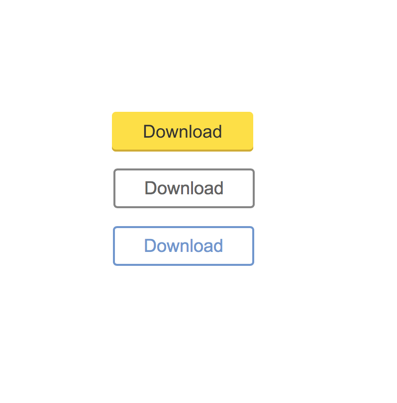
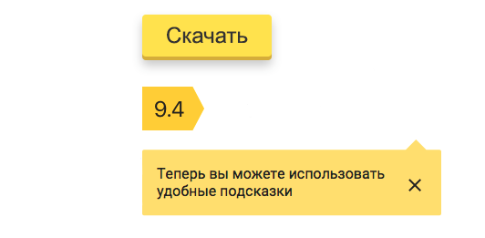

# CSS по БЭМ

В БЭМ-методологии CSS используется для оформления страниц и является одной из [технологий реализации блока](../key-concepts/key-concepts.ru.md#Технология-реализации).

Основные принципы работы с CSS рассматриваются в следующих разделах:
* [Селекторы](#Селекторы)
  * [Селекторы классов](#Селекторы-классов)
  * [Совмещение тега и класса в селекторе](#Совмещение-тега-и-класса-в-селекторе)
  * [Вложенные селекторы](#Вложенные-селекторы)
  * [Именование](#Именование)
* [Модификаторы](#Модификаторы)
* [Миксы](#Миксы)
 * [Внешняя геометрия и позиционирование](#Внешняя-геометрия-и-позиционирование)
 * [Стилизация групп блоков](#Стилизация-групп-блоков)
* [Разделение кода на части](#Разделение-кода-на-части)
 * [Принцип единственной ответственности](#Принцип-единственной-ответственности)
 * [Принцип открытости/закрытости](#Принцип-открытостизакрытости)
 * [DRY](#dry)
 * [Композиция вместо наследования](#Композиция-вместо-наследования)
* [Разделение кода по уровням переопределения и использование сборки](#Работа-с-уровнями-переопределения)
* [Как перейти на CSS по БЭМ](#Как-перейти-на-css-по-БЭМ)

### Селекторы

В БЭМ не используют селекторы тегов и идентификаторов. Стили блоков и элементов описываются через селекторы классов.

#### Селекторы классов

Позволяют указать конкретный HTML-элемент страницы, независимо от тега. Обращение к селектору класса происходит через атрибут `class`, который должен иметь каждый HTML-элемент.

Значением атрибута `class` может быть разделенный пробелами список слов. Это позволяет использовать разные [БЭМ-сущности](../key-concepts/key-concepts.ru.md#БЭМ-сущность) на одном DOM-узле.

**Пример**

HTML-реализация:

```html
<header class="header">
    <!--
    `header__button` — элемент блока `header`;
    `button` — блок;
    `button_theme_islands` — модификатор.
    -->
    <button class="header__button button button_theme_islands">...</button>
</header>
```

#### Совмещение тега и класса в селекторе

Методология БЭМ не рекомендует совмещать теги и классы в селекторе. Объединение тега и класса (например, `button.button`) повышает специфичность CSS-правил, что усложняет задачу их переопределения. Это приводит к войнам значимости, при которых таблицы стилей загружаются излишне сложными селекторами.

**Пример**

HTML-реализация:

```html
 <button class="button">...</button>
```

CSS-правила заданы в селекторе `button.button`.

Допустим, блоку добавили модификатор `active` с значением `true`:

```html
<button class="button button_active">...</button>
```

Селектор `.button_active` не переопределит свойства блока, записанные как `button.button`, так как специфичность `button.button` выше чем у `.button_active`. Для успешного переопределения селектор модификатора блока также должен быть скомбинирован с тегом `button.button_active`.

В результате развития проекта могут, например, появиться блоки с селекторами `input.button`, `span.button` и `a.button`. В таком случае все модификаторы блока `button` и вложенные в него элементы потребуют четыре разные декларации для каждого случая.

Нужно стараться использовать простые селекторы классов:

```css
.button {}
.button_active {}
```

#### Вложенные селекторы

Методология БЭМ допускает использование вложенных селекторов, но рекомендует по максимуму их сократить. Вложенные селекторы увеличивают связность кода и делают его повторное использование невозможным.

Например, вложенность уместна, если нужно изменить стили элементов в зависимости от состояния блока или заданной темы.

**Пример**

CSS-реализация:

```css
.button_hovered .button__text
{
    text-decoration: underline;
}

.button_theme_islands .button__text
{
    line-height: 1.5;
}
```

#### Именование

Имя селектора должно полно и точно описывать представляемую им БЭМ-сущность.

В качестве примера рассмотрим следующие четыре строки CSS-кода:

```css
.button {}
.button__icon {}
.button__text {}
.button_theme_islands {}
```

С определенной долей вероятности можно предположить, что мы имеем дело с одним блоком и его HTML-реализация выглядит следующим образом:

```html
<button class="button button_theme_islands">
    <span class="button__icon"></span>

    <span class="button__text">...</span>
</button>
```

Сложнее сделать подобное предположение с такой группой селекторов:

```css
.button {}
.icon {}
.text {}
.theme_islands {}
```

Имена `icon`, `text`, `theme_islands` не так информативны.

Общие [правила именования блоков, элементов и модификаторов](../naming-convention/naming-convention.ru.md) позволяют:
* сделать имена CSS-селекторов максимально информативными и понятными;
* решить проблему коллизии имен;
* независимо описывать стили блоков и их опциональных элементов.

**Пример**

HTML-реализация:

```html
<!-- Блок `logo` -->
<div class="logo logo_theme_islands">
    
</div>

<!-- Блок `user` -->
<div class="user user_theme_islands">
    
    ...
</div>
```

Именование CSS-классов:

```css
.logo {}                  /* CSS-класс блока `logo` */

.logo__img {}             /* CSS-класс элемента `logo__img` */

.logo_theme_islands {}    /* CSS-класс модификатора `logo_theme_islands` */

.user {}                  /* CSS-класс блока `user` */

.user__img {}             /* CSS-класс элемента `user__img` */

.user_theme_islands {}    /* CSS-класс модификатора `user_theme_islands` */
```

### Модификаторы

Модификаторами в БЭМ задают блокам внешний вид, состояние и поведение. Изменение оформления блока производится при помощи установки/снятия модификатора.

**Пример**

HTML-реализация:

```html
<button class="button button_size_s">...</button>
```

CSS-реализация:

```css
.button {
    font-family: Arial, sans-serif;
    text-align: center;
}

.button_size_s {
    font-size: 13px;
    line-height: 24px;
}

.button_size_m {
    font-size: 15px;
    line-height: 28px;
}

```
Используя модификаторы, можно изменять представление блока, точечно переопределяя необходимые для этого CSS-свойства.

Например, так:

```html
<button class="button button_size_s">...</button>
<button class="button button_size_m">...</button>
```

Это избавляет от ненужного «Copy-Paste».

### Миксы

Позволяют:
* совмещать поведение и стили нескольких сущностей без дублирования кода;
* одинаково форматировать разные HTML-элементы.

#### Внешняя геометрия и позиционирование

В CSS по БЭМ стили, отвечающие за внешнюю геометрию и позиционирование, задаются через родительский блок.

**Пример**

HTML-реализация:

```html
<!-- Блок `header` -->
<header class="header">
    <button class="button">...</button>
</header>

<!-- Блок `form` -->
<form class="form" >
</form>
```

CSS-реализация кнопки:

```css
.button {
    font-family: Arial, sans-serif;
    text-align: center;
    border: 1px solid black;    /* Рамка */
    margin: 30px;               /* Отступ */
}
```

**Задача**

Использовать кнопку из блока `header` в блоке `form`.

Блоку `button` установлен отступ в `30px`, который может помешать его переиспользовать.

Решение выглядит следующим образом:

**Пример**

HTML-реализация:

```html
<!-- Блок `header` -->
<header class="header">
    <!-- К блоку `button` добавили класс `header__button` -->
    <button class="button header__button">...</button>
</header>

<!-- Блок `form` -->
<form class="form" >
    <button class="button">...</button>
</form>
```

CSS-реализация кнопки:

```css
.button {
    font-family: Arial, sans-serif;
    border: 1px solid black;    /* Рамка */
}
```

CSS-реализация элемента `button` блока `header`:

```css
.header__button {
    margin: 30px;
    position: relative;
}
```

В данном примере внешняя геометрия и позиционирование блока `button` задана через элемент `header__button`. Блок `button` стал независимым и универсальным, потому что не специфицирует никакие отступы.

#### Стилизация групп блоков

Иногда необходимо применить одинаковое форматирование сразу к нескольким различным HTML-элементам веб-страницы.
Обычно для решения подобных задач применяют групповые селекторы.

**Пример**

HTML-реализация:

```html
<article class="article"></article>

<footer class="footer">
    <div class="copyright"></div>
</footer>
```

CSS-реализация:

```css
article, .footer div {
    font-family: Arial, sans-serif;
    font-size: 14px;
    color: #000;
}
```

В данном примере текст внутри блоков `article` и `copyright` имеет один и тот же цвет и шрифт.

Несмотря на то, что групповые селекторы позволяют быстро изменить дизайн страницы, такой подход увеличивает связность кода.

Поэтому в БЭМ для того, чтобы единообразно отформатировать целый набор HTML-элементов, используют [миксы](../key-concepts/key-concepts.ru.md#Микс).

**Пример**

HTML-реализация:

```html
<article class="article text"></article>

<footer class="footer">
    <div class="copyright text"></div>
</footer>
```

CSS-реализация:

```css
.text {
    font-family: Arial, sans-serif;
    font-size: 14px;
    color: #000;
}
```

### Разделение кода на части

К CSS по БЭМ применяются основные принципы организации и хранения кода:
  * разделение кода на отдельные части — логика работы каждого блока, его опциональных элементов и модификаторов описывается в отдельных файлах;
  * CSS-файлы для каждого компонента хранятся в соответствии с [правилами организации файловой структуры](../filestructure/filestructure.ru.md) БЭМ-проекта.

Разделение кода на части и строгая организация файловой структуры проекта позволяет:
  * облегчить навигацию по проекту;
  * повторно использовать и переносить компоненты;
  * работать с уровнями переопределения и [использовать сборку](../build/build.ru.md).

**Пример**

Блок `button` в файловой структуре проекта:

```files
button/                      # Директория блока `button`
    _size
        button_size_s.css    # Реализация модификатора в технологии CSS

    button.css               # Реализация блока `button` в технологии CSS
```

Такое разделение позволяет быстро находить нужные файлы.

#### Принцип единственной ответственности

Как и в объектно-ориентированном программировании, принцип единственной ответственности (англ. Single responsibility principle) в CSS по БЭМ означает, что каждая CSS-реализация должна иметь одну ответственность.

**Пример**

HTML-реализация:

```html
<header class="header">
    <button class="button header__button">...</button>
</header>
```

CSS-реализация:

```css
.button {
    font-family: Arial, sans-serif;
    border: 1px solid black;
    background: #fff;
}
```

Ответственность: внешняя геометрия и позиционирование (зададим внешнюю геометрию и позиционирование для блока `button` через элемент `header__button`).

Верно:

```css
.header__button {
    margin: 30px;
    position: relative;
}
```

Неверно:

```css
.header__button {
    font-family: Arial, sans-serif;
    position: relative;
    border: 1px solid black;
    margin: 30px;
}
```

Селекторы с одиночной ответственностью придают коду больше гибкости.

#### Принцип открытости/закрытости

Любой HTML-элемент страницы должен быть открыт для модификации, но закрыт для изменения. Разрабатывать новые CSS-реализации следует так, чтобы не пришлось менять уже существующие.

**Пример**

HTML-реализация:

```html
<button class="button">...</button>
<button class="button">...</button>
```

CSS-реализация:

```css
.button {
    font-family: Arial, sans-serif;
    text-align: center;
    font-size: 11px;
    line-height: 20px;
}
```

Предположим, что появилась необходимость изменить размер одной из кнопок.
Следуя принципу открытости/закрытости, модифицируем кнопку.

HTML-реализация:

```html
<button class="button">...</button>
<button class="button button_size_s">...</button>
```

CSS-реализация:

```css
.button {
    font-family: Arial, sans-serif;
    text-align: center;
    font-size: 11px;
    line-height: 20px;
}

.button_size_s {
    font-size: 13px;
    line-height: 24px;
}
```

Существующая функциональность кнопки расширена при помощи класса `button_size_s` (переопределены свойства `font-size` и `line-height`). Теперь на странице есть две кнопки разного размера.

**Нарушение принципа открытости/закрытости**

* Изменение существующей CSS-реализации

  ```css
  .button {
      font-family: Arial, sans-serif;
      text-align: center;
      font-size: 13px;
      line-height: 24px;
  }
  ```

  Текущая CSS-реализация кнопки должна быть закрыта для редактирования. Изменения коснутся всех блоков `button`.

* Модификация контекстом

  ```css
  .button {
      font-family: Arial, sans-serif;
      text-align: center;
      font-size: 11px;
      line-height: 20px;
  }

  .content .button {
      font-size: 13px;
      line-height: 24px;
  }
  ```

Оформление кнопки стало зависеть от ее расположения. Изменения коснутся всех блоков `button` внутри блока `content`.

#### DRY

Принцип разработки программного обеспечения, нацеленный на снижение повторений в коде.

Применительно к методологии БЭМ суть данного принципа заключается в том, что каждая БЭМ-сущность должна иметь единственное, однозначное представление в рамках системы.

**Пример**

HTML-реализация:

```html
<button class="button">...</button>
<button class="btn">...</button>
```

CSS-реализация:

```css
.button {
    font-family: Arial, sans-serif;
    text-align: center;
    color: #000;
    background: #fff;
}

.btn {
    font-family: Arial, sans-serif;
    text-align: center;
    color: #000;
    background: rgba(255, 0, 0, 0.4);
}
```

Как видно из примера, в селекторе `btn` повторена существующая реализация блока `button`.

Перепишем пример в соответствии с принципом DRY:

HTML-реализация:

```html
<button class="button button_theme_islands">...</button>
<button class="button button_theme_simple">...</button>
```

CSS-реализация:

```css
.button {
    font-family: Arial, sans-serif;
    text-align: center;
}

.button_theme_islands {
    color: #000;
    background: #fff;
}

.button_theme_simple {
    color: #000;
    background: rgba(255, 0, 0, 0.4);
}
```
Благодаря добавлению модификаторов, мы избавились от блока `btn`.

**Важно!** Принцип DRY имеет отношение только к функционально однотипным компонентам страницы, например, кнопки.

**Пример**



Как видно, между кнопками есть небольшие внешние отличия. Принцип DRY касается именно таких сущностей — функционально однотипных, но разных по оформлению.

Не имеет смысла объединять разные по типу блоки, только потому что у них, например, одинаковый цвет или размер.

**Пример**



#### Композиция вместо наследования

Наследование — это механизм, позволяющий описать новый CSS-класс на основе существующего (родительского, базового). Класс-потомок может добавить собственные свойства, а также пользоваться родительскими.

Новые CSS-реализации в БЭМ собирают из уже существующих, путем их объединения. Это сохраняет код несвязным и гибким.

**Пример**

Допустим, есть три готовые реализации:

* кнопка — блок `button`;
* меню — блок `menu`;
* всплывающее окно — блок `popup`.

**Задача**

Реализовать раскрывающийся список (блок `select`).

Разработать раскрывающийся список с произвольным внешним видом — весьма непростая задача. Однако, если есть готовые компоненты (кнопка, всплывающее окно и меню), остается только правильно описать их взаимодействие.

**Пример**

HTML-реализация:

```html
<div class="select">
    <button class="button select__button">
        <span class="button__text">Блок</span>
    </button>
</div>

<div class="popup">
    <div class="menu">
        <div class="menu-item">Блок</div>
        <div class="menu-item">Элемент</div>
        <div class="menu-item">Модификатор</div>
    </div>
</div>
```

### Работа с уровнями переопределения

Применение принципов БЭМ-методологии к CSS позволяет разделять представление блоков по разным уровням.

Разделение по уровням позволяет:
  * реализовывать новый внешний вид блока на другом уровне переопределения, сохраняя предыдущий, наследовать и дополнять его;
  * полностью перекрывать внешний вид блока (переопределять);
  * добавлять блоки с новым представлением.

С помощью уровней переопределения можно создать универсальную CSS-библиотеку блоков и изменять ее на проектном уровне. Затем использовать сборку и включать в проект только необходимое представление блоков.

**Пример**

```files
common.blocks/
    button/
        button.css    # Базовая CSS-реализация кнопки

desktop.blocks/
    button/
        button.css    # Особенности кнопки для desktop

mobile.blocks/
    button/
        button.css    # Особенности кнопки для mobile
```

При сборке в файл `desktop.css` попадут все базовые CSS-правила кнопки с уровня `common` и переопределенные правила с уровня `desktop`.

```css
@import "common.blocks/button/button.css";    /* Базовые CSS-правила */
@import "desktop.blocks/button/button.css";   /* Особенности desktop */
```

Файл `mobile.css` будет включать базовые CSS-правила кнопки с уровня `common` и переопределенные правила с уровня `mobile`.

```css
@import "common.blocks/button/button.css";    /* Базовые CSS-правила */
@import "mobile.blocks/button/button.css";    /* Особенности mobile */
```

Разделение представления блока `button` по разным уровням позволяет:

* Полностью перекрыть внешний вид блока на другом уровне переопределения.

   `common.blocks/button/button.css`

  ```css
  .button {
      font-family: Arial, sans-serif;
      font-size: 11px;
      line-height: 24px;
      background: #fff;
  }
  ```

  `desktop.blocks/button/button.css`

  ```css
  .button {
      font-family: 'Roboto', sans-serif;
      font-size: 13px;
      line-height: 28px;
      background: yellow;
  }
  ```

* Добавить или частично изменить внешний вид блока на другом уровне переопределения.

  `common.blocks/button/button.css`

  ```css
  .button {
      font-family: Arial, sans-serif;
      font-size: 11px;
      line-height: 24px;
      background: #fff;
  }
  ```

  `desktop.blocks/button/button.css`

  ```css
  .button {
      background: #fff;
      color: rgb(255, 0, 0);
      box-shadow: 0 0 10px rgba(0,0,0,0.5);
  }
  ```

## Как перейти на CSS по БЭМ

Чтобы реализовать принципы БЭМ в проекте, необходимо:

* абстрагироваться от DOM-модели и научиться создавать блоки;
* не использовать ID-селекторы и селекторы тегов;
* минимизировать количество вложенных селекторов;
* использовать соглашение по именованию CSS-классов, чтобы избежать коллизии имен и сделать имена селекторов максимально информативными и понятными;
* работать в единых терминах блоков, элементов и модификаторов;
* выносить в модификаторы CSS-свойства блока, изменение которых кажется вероятным;
* использовать миксы;
* разделять код на мелкие независимые части для удобства работы с отдельными блоками;
* повторно использовать блоки.

### Как начать реализовывать идеи БЭМ в существующем проекте?

* Создавайте новые компоненты по БЭМ, а старые изменяйте по мере необходимости.
* Проектируйте блоки, руководствуясь принципами, описанными выше.
* Используйте префиксы в именах CSS-классов (например, `bem-`), чтобы отличить новый код от старого.

После знакомства с CSS по БЭМ переходите к рассмотрению особенностей реализации [JavaScript по БЭМ-методологии](../bem-for-js/bem-for-js.ru.md).
