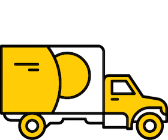
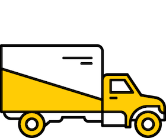
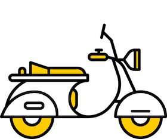

# CSS по БЭМ

CSS в БЭМ используется для стилизации страниц и рассматривается как одна из [технологий реализации блоков](../key-concepts/key-concepts.ru.md#Технология-реализации).

## Основные принципы компонентного подхода в CSS по БЭМ
* [Селекторы классов](#Селекторы-классов)
* [Совмещение тега и класса в селекторе](#Совмещение-тега-и-класса-в-селекторе)
* [Вложенные селекторы](#Вложенные-селекторы)
* [Именование селекторов](#Именование-селекторов)
* [Работа с модификаторами](#Работа-с-модификаторами)
* [Миксы](#Миксы)
 * [Внешняя геометрия и позиционирование](#Внешняя-геометрия-и-позиционирование)
 * [Стилизация групп блоков](#Стилизация-групп-блоков)
* [Разделение кода на части](#Разделение-кода-на-части)
 * [Принцип единственной ответственности](#Принцип-единственной-ответственности)
 * [Принцип открытости/закрытости](#Принцип-открытостизакрытости)
 * [DRY](#dry)
 * [Композиция вместо наследования](#Композиция-вместо-наследования)
* [Разделение кода по уровням переопределения и использование сборки](#Работа-с-уровнями-переопределения)
* [Как перейти на CSS по БЭМ](#Как-перейти-на-css-по-БЭМ)

## Селекторы классов

Стили блоков и элементов в БЭМ описываются через селекторы классов.

Каждый HTML-элемент должен иметь атрибут `class`.

**Пример**

HTML-реализация:

```html
<button class="button">...</button>
```

CSS-реализация:

```css
.button {}  
```

Один и тот же класс можно назначить любому количеству  HTML-элементов на странице, что позволяет переиспользовать блоки.

**Пример**

```html
<header>
    <button class="button">...</button>
</header>
<main>
    <button class="button">...</button>
</main>
<footer>
    <button class="button">...</button>
</footer>
```

**Важно!** В БЭМ не используют селекторы тегов и идентификаторов.

### Множественные классы

В HTML значением атрибута `class` может быть разделенный пробелами список слов.

**Пример**

```html
<button class="button button_theme_islands">...</button>
```

Множественные классы делают возможным применение миксов и модификаторов. Особенности их реализаций в CSS мы рассмотрим ниже.

## Совмещение тега и класса в селекторе

Совмещение тега и класса в селекторе повышает специфичность CSS-правил, что усложняет задачу их переопределения.
Зачастую это приводит к войнам значимости, при которых таблицы стилей загружаются излишне сложными селекторами.
Суть этой проблемы проще объяснить на примере:

```html
 <button class="button">...</button>
```

Записываем для него CSS-правила в селекторе `button.button`.

Добавим модификатор:

```html
 <button class="button button_active">...</button>
```

Система приоритетов стилевых селекторов работает так:

* Селектор тегов имеет значимость 1 пункт.
* Селектор классов — 10 пунктов.
* ID-селектор — 100.
* Встроенный (inline) стиль — 1000.

Следовательно, селектор `.button_active` не переопределит свойства блока, записанные как `button.button`, так как специфичность `button.button` равна 11 (10 — для названия класса и 1 — для селектора тега), а `.button_active` — 10. Для успешного переопределения селектор модификатора блока также должен быть скомбинирован с тегом `button.button_active`.

В результате развития проекта могут появиться блоки с селекторами `input.button`, `span.button` и, например, `a.button`. В таком случае все модификаторы блока `button` и вложенные в него элементы потребуют четыре разные декларации для каждого случая.

## Вложенные селекторы

Ключевая идея БЭМ — независимость блоков. Вложенные селекторы увеличивают связность кода и делают его повторное использование невозможным. Это противоречит принципам БЭМ.

Методология БЭМ допускает использование таких селекторов, но рекомендует по максимуму их сократить.

Например, вложенность уместна, если нужно изменить стили элементов в зависимости от состояния блока или заданной ему темы:

**Пример**

```css
.button_hovered .button__text
{
    text-decoration: underline;
}
.button_theme_islands .button__text
{
    line-height: 1.5;
}
```

## Именование селекторов

Важнейший принцип именования селекторов состоит в том, что имя должно полно и точно описывать сущность, представляемую селектором.
В качестве примера рассмотрим следующие четыре строки CSS-кода:

```css
.button {}                 
.button__icon {}         
.button__text {}           
.button_theme_islands {}    
```

С определенной долей вероятности можно предположить, что мы имеем дело с одним блоком и его HTML-реализация выглядит следующим образом:

```html
<button class="button button_theme_islands">
    <span class="button__icon"></span>
    <span class="button__text">Twitter</span>
</button>
```

Попробуйте проделать тоже самое с такой группой селекторов:

```css
.button {}                 
.icon {}            
.text {}         
.theme_islands {}
```

Общие [правила именования блоков, элементов и модификаторов](../naming-convention/naming-convention.ru.md) позволяют:
* сделать имена CSS-селекторов максимально информативными и понятными;
* решить проблему коллизии имен;
* независимо описывать стили блоков и их опциональных элементов.

**Пример**

```html
<!--  блок `logo` -->
<div class="logo logo_theme_islands">
    
</div>
<!--  блок `user` -->
<div class="user user_theme_islands">
    
    ...
</div>
```

Именование CSS-классов:

```css
.logo {}                  /* CSS-класс блока `logo` */
.logo__img {}             /* CSS-класс элемента `logo__img` */
.logo_theme_islands {}    /* CSS-класс модификатора `logo_theme_islands` */
.user {}                  /* CSS-класс блока `user` */
.user__img {}             /* CSS-класс элемента `user__img` */
.user_theme_islands {}    /* CSS-класс модификатора `user_theme_islands` */
```

## Работа с модификаторами

Модификаторами в БЭМ принято задавать блокам определенный внешний вид, состояние и поведение. Изменение оформления блока производится при помощи установки/снятия модификатора.

**Пример**

HTML-реализация:

```html
<button class="button button_size_s">...</button>
```

CSS-реализация:

```css
.button {
    font-family: Arial, Helvetica, sans-serif;
    position: relative;
}

.button_size_s {
    font-size: 13px;
    line-height: 24px;
}

.button_size_m {
    font-size: 15px;
    line-height: 28px;
}

```
Преимущество в том, что мы можем изменять представление блока, точечно переопределяя необходимые для этого CSS-свойства.

Например, так:

```html
<button class="button button_size_s">...</button>
<button class="button button_size_m">...</button>
```

Таким образом, использование модификаторов избавляет нас от ненужного «Copy-Paste».

## Миксы

### Внешняя геометрия и позиционирование

В CSS по БЭМ, стили, отвечающие за внешнюю геометрию и позиционирование, принято задавать через родительский блок.

Рассмотрим следующий пример:

**Пример**

HTML-реализация:

```html
<!-- Блок `header`  -->
<header class="header">  
    <button class="button">...</button>  
</header>
<!-- Блок `form`  -->
<form class="form" >
</form>
```

**Задача**

Использовать эту же кнопку в блоке `form`.

CSS-реализация кнопки:

```css
.button {
    font-family: Arial, Helvetica, sans-serif;
    position: relative;
    border: 1px solid black;    /* Рамка */
    margin: 30px;               /* Отступ */
}
```

Как видно, у блока `button` есть отступ в `30px`, который может помешать нам его переиспользовать.

Решение проблемы выглядит следующим образом:

**Пример**

HTML-реализация:

```html
<!-- Блок `header`  -->
<header class="header">  
    <!-- К блоку `button` добавили класс `header__button`-->
    <button class="button header__button">...</button>  
</header>
<!-- Блок `form`  -->
<form class="form" >
    <button class="button">...</button>  
</form>
```

CSS-реализация кнопки:

```css
.button {
    font-family: Arial, Helvetica, sans-serif;
    border: 1px solid black;    /* Рамка */
}
```

CSS-реализация элемента `button` блока `header`:

```css
.header__button {
    margin: 30px;
    position: relative;
}
```

В данном примере, мы задали внешнюю геометрию и позиционирование для блока `button` через элемент `header__button`, а сам блок `button` сделали универсальным.
Блок стал независимым, потому что он не специфицирует никакие отступы.

### Стилизация групп блоков

Иногда бывает необходимо применить одинаковое форматирование сразу к нескольким различным HTML-элементам веб-страницы.
Например, нужно, чтобы текст внутри блоков `article` и  `copyright` имел один и тот же цвет и шрифт.

**Пример**

HTML-реализация:

```html
<article class="article"></article>

<footer class="footer">
    <div class="copyright"></div>
</footer>
```

Обычно для решения подобных задач применяют групповые селекторы.

```css
article, .footer div {
    font-family: Arial, Helvetica, sans-serif;
    font-size: 14px;
    color: #000;
}
```

Несмотря на то, что групповые селекторы позволяют быстро изменить дизайн страницы, такой подход увеличивает связность кода.

Поэтому, в БЭМ для того, чтобы единообразно отформатировать целый набор HTML-элементов, используют миксы.

**Пример**

HTML-реализация:

```html
<article class="article text"></article>

<footer class="footer">
    <div class="copyright text"></div>
</footer>
```

```css
.text {
    font-family: Arial, Helvetica, sans-serif;
    font-size: 14px;
    color: #000;
}
```

## Разделение кода на части

К CSS по БЭМ применяются основные принципы организации и хранения кода:
  * разделение кода на отдельные части — логика работы каждого блока, его опциональных элементов и модификаторов описывается в отдельных файлах;
  * CSS-файлы для каждого компонента хранятся в соответствии с [правилами организации файловой структуры](../filesystem/filesystem.ru.md) БЭМ-проекта.

**Пример**

Блок `button` в файловой структуре проекта:

```files
button/                      # Директория блока `button`
    _size
        button_size_s.css    # Реализация модификатора в технологии CSS
button.css                   # Реализация блока `button` в технологии CSS
```

Разделение кода на части и строгая организация файловой системы проекта позволяет:
* облегчить навигацию по проекту;
* повторно использовать и переносить компоненты;
* работать с уровнями переопределения и использовать сборку.

### Принцип единственной ответственности

Как и в объектно-ориентированном программировании, принцип единственной ответственности (англ. Single responsibility principle) в CSS по БЭМ означает, что каждая CSS-реализация должна иметь одну ответственность. Все свойства селектора класса должны быть направлены исключительно на обеспечение этой ответственности.

**Пример**

HTML-реализация:

```html
<header class="header">  
    <button class="button header__button">...</button>  
</header>
```

CSS-реализация:

```css
.button {
    font-family: Arial, Helvetica, sans-serif;
    border: 1px solid black;
    background-color: white;                     
}
```

Ответственность: внешняя геометрия и позиционирование (зададим внешнюю геометрию и позиционирование для блока`button` через элемент `header__button`).

Верно:

```css
.header__button {
    margin: 30px;
    position: relative;
}
```

Неверно:

```css
.header__button {
    font-family: Arial, Helvetica, sans-serif;
    position: relative;
    border: 1px solid black;    
    margin: 30px;
}
```

Таким образом, мы можем придать нашему коду гораздо больше гибкости и легко переиспользовать блоки.

### Принцип открытости/закрытости

Означает что любой HTML-элемент страницы должен быть открыт для модификации, но закрыт для изменения. Таким образом, разрабатывать новые CSS-реализации следует так, чтобы не пришлось менять уже существующие.

Рассмотрим пример с кнопками.

**Пример**

HTML-реализация:

```html
<button class="button">...</button>
<button class="button">...</button>
```

CSS-реализация:

```css
.button {
    font-family: Arial, Helvetica, sans-serif;
    position: relative;  
    font-size: 11px;
    line-height: 20px;
}
```

Предположим, что появилась необходимость изменить размер одной из кнопок.
Следуя принципу открытости/закрытости, модифицируем кнопку:

HTML-реализация:

```html
<button class="button">...</button>
<button class="button button_size_s">...</button>
```

CSS-реализация:

```css
.button {
    font-family: Arial, Helvetica, sans-serif;
    position: relative;  
    font-size: 11px;
    line-height: 20px;
}

.button_size_s {
    font-size: 13px;
    line-height: 24px;
}
```

Мы расширили существующую функциональность кнопки при помощи класса `button_size_s`, переопределив свойства `font-size` и `line-height`. Теперь на странице есть две кнопки разного размера.

HTML-реализация:

```html
<button class="button">...</button>
<button class="button button_size_s">...</button>
```

Нарушение принципа открытости/закрытости:

**Пример**

Изменение существующей CSS-реализации:

```css
.button {
    font-family: Arial, Helvetica, sans-serif;
    position: relative;
    font-size: 13px;
    line-height: 24px;
}
```

Модификация контекстом:

```css
.button {
    font-family: Arial, Helvetica, sans-serif;
    position: relative;  
    font-size: 11px;
    line-height: 20px;
}

.content .button {  
    font-size: 13px;
    line-height: 24px;
}
```

Оформление кнопки стало зависеть от ее расположения. Изменения коснутся всех блоков `button` внутри блока `content`.

Помните: БЭМ-сущности открыты для расширения и закрыты для модификации.

### DRY

DRY, Don’t repeat yourself (Не повторяйся) — принцип разработки программного обеспечения, нацеленный на снижение повторений в коде.

Применительно к методологии БЭМ, его можно интерпретировать следующим образом:
каждая БЭМ-сущность должна иметь единственное, однозначное представление в рамках системы.

**Пример**

HTML-реализация:

```html
<button class="button">...</button>
<button class="btn">...</button>
```

CSS-реализация:

```css

.button {
    font-family: Arial, Helvetica, sans-serif;
    position: relative;
    background-color: red;
}

.btn {
    font-family: Arial, Helvetica, sans-serif;
    position: relative;
    background-color: blue;
}
```

Как видно из примера, в селекторе `btn` мы фактически повторили существующую реализацию блока `button`.
Пытайтесь минимизировать случайные повторения.

**Важно!** Следует оговориться, что принцип DRY имеет отношение только к функционально однотипным компонентам страницы: кнопки, заголовки, списки, меню и т. п..

#### Пример из жизни

Например, грузовые автомобили. Как видно из примера, между ними есть небольшие внешние отличия. В принципе DRY речь идет как раз о таких сущностях, функционально однотипных, но разных по оформлению.




Второй пример — мотороллер и грузовой автомобиль. Они также являются средствами передвижения, однако, между ними много конструктивных отличий.




Следовательно, нет смысла объединять разные по типу блоки, только потому что у них, например, одинаковый цвет или размер.

### Композиция вместо наследования

Наследование представляет собой механизм, позволяющий описать новый CSS-класс на основе уже существующего (родительского, базового) класса. Класс-потомок может добавить собственные свойства, а также пользоваться родительскими.
Вместо наследования, новые CSS-реализации в БЭМ принято собирать из уже существующих, путем их объединения. Это сохраняет код несвязным и гибким.

**Пример**

Допустим, у нас есть три готовые реализации:

* кнопка — блок `button`;
* меню — блок `menu`;
* всплывающее окно — блок `popup`.

**Задача**

Реализовать раскрывающийся список (блок `select`).

Разработать раскрывающийся список с произвольным внешним видом — весьма непростая задача. Однако, если у вас есть готовые компоненты (кнопка, всплывающее окно и меню), остается только грамотно описать их взаимодействие.

```html
<div class="select">
    <button class="button select__button">
        <span class="button__text">Блок</span>
    </button>
</div>
<div class="popup">
    <div class="menu">
        <div class="menu-item">Блок</div>
        <div class="menu-item">Элемент</div>
        <div class="menu-item">Модификатор</div>
    </div>
</div>
```

## Работа с уровнями переопределения

Применение принципов БЭМ-методологии к CSS позволяет разделять представление блоков по разным уровням:
  * реализовывать новый внешний вид блока на другом уровне переопределения, сохраняя предыдущий, наследовать и дополнять его;
  * полностью перекрывать внешний вид блока (переопределять);
  * добавлять новые блоки с новым представлением, которого не было на предыдущих уровнях.

С помощью уровней переопределения можно создать универсальную CSS-библиотеку блоков и изменять ее на проектном уровне. Затем использовать сборку и включать в проект только необходимое представление блоков.

Рассмотрим на примере:

```files
common.blocks/
    button/
        button.css    # Базовая CSS-реализация кнопки

desktop.blocks/
    button/
        button.css    # Особенности кнопки для desktop

mobile.blocks/
    button/
        button.css    # Особенности кнопки для mobile
```

При сборке в файл `desktop.css` попадут все базовые CSS-правила кнопки с уровня `common` и переопределенные правила с уровня `desktop`.

```css
@import "common.blocks/button/button.css";    /* Базовые CSS-правила */
@import "desktop.blocks/button/button.css";   /* Особенности desktop */
```

Файл `mobile.css` будет включать базовые CSS-правила кнопки с уровня `common` и переопределенные правила с уровня `mobile`.

```css
@import "common.blocks/button/button.css";    /* Базовые CSS-правила */
@import "mobile.blocks/button/button.css";    /* Особенности mobile */
```

Запись в стиле БЭМ позволяет:

* Полностью перекрывать внешний вид блока на другом уровне переопределения.

`common.blocks/button/button.css`

```css
.button {
    font-family: Arial, Helvetica, sans-serif;
    font-size: 11px;
    line-height: 24px;
    background-color: white;
}
```

`desktop.blocks/button/button.css`

```css
.button {
    font-family: 'Roboto', sans-serif;
    font-size: 13px;
    line-height: 28px;
    background-color: yellow;
}
```

* Добавлять или частично изменять внешний вид блока на другом уровне переопределения.

`common.blocks/button/button.css`

```css
.button {
    font-family: Arial, Helvetica, sans-serif;
    font-size: 11px;
    line-height: 24px;
    background-color: white;
}
```

`desktop.blocks/button/button.css`

```css
.button {
    background-color: white;
    color: red;
    box-shadow: 0 0 10px rgba(0,0,0,0.5);
}
```

## Как перейти на CSS по БЭМ

Чтобы начать реализовать идеи БЭМ в вашем проекте:

* абстрагируйтесь от DOM-модели и научитесь создавать независимые компоненты — блоки;
* не используйте ID-селекторы и селекторы тегов;
* старайтесь минимизировать количество вложенных селекторов;
* работайте в единых терминах блоков, элементов и модификаторов;
* выносите в модификаторы CSS-свойства блока, изменение которых кажется вероятным;
* используйте соглашение по именованию CSS-классов, для того чтобы избежать коллизии имен и сделать имена селекторов максимально информативными и понятными;
* повторно используйте блоки.

Следующие принципы также полезны:
* для удобства работы с отдельными блоками, разделяйте код на независимые файлы;
* используйте сборку;
* включайте в сборку только нужную CSS-реализацию блока;
* переходите на JS по БЭМ.
