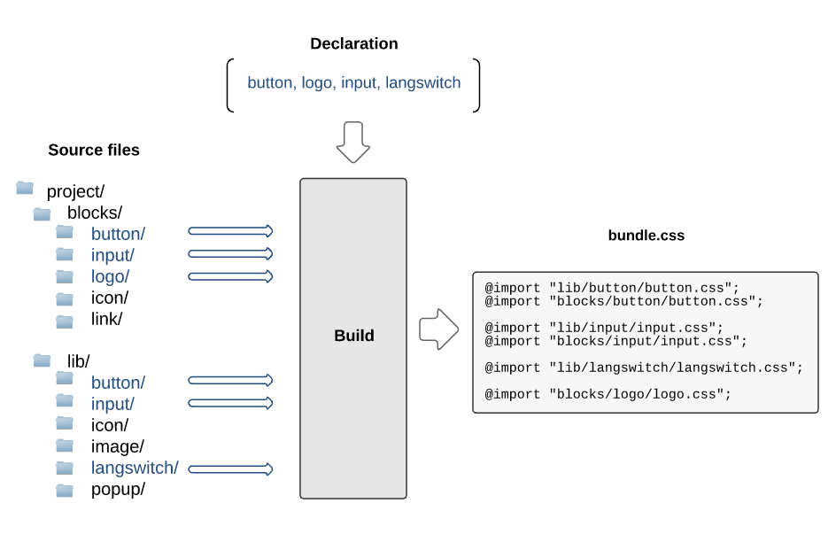

# BEM project building methodology

Any project developed using the BEM methodology has a multi-level file structure. Such a structure results from the component-based approach. In BEM, [blocks](../key-concepts/key-concepts.en.md#block) can be implemented in one or more [technologies](../key-concepts/key-concepts.en.md#implementation-technology). Each technology is stored in a separate file. Consequently, a build process is required in order to obtain general project files from individual files. You can use any of the available [build tools](#build-tools).

Here is an example of a file structure organization of a BEM project:

```files
blocks/               # Project level
  input/              # `input` block directory
    input.css         # `input` block implementation in CSS technology
    input.js          # `input` block implementation in JavaScript technology
  icon/
    icon.css
library/              # Library level
  input/
    input.js          # `input` block basic implementation in JavaScript technology
  button/
```

> To find out more about the reasons for dividing a block implementation into separate files, read [File structure organization of a BEM project](../filestructure/filestructure.en.md).

The build process takes care of the following:
* combines individual [implementation files](../filestructure/filestructure.en.md#a-block-implementation-is-divided-into-separate-files) spread throughout the system.
* includes only the necessary blocks, [elements](../key-concepts/key-concepts.en.md#element) and [modifiers](../key-concepts/key-concepts.en.md#modifier) in the project, out of those contained in the file structure;
* ensures that the files are linked to the project in a correct order.

## Main stages of the build process

In order to obtain a finished project part (build result), such as a web page, from individual files, we need to:

* [list blocks, elements, and modifiers involved in the creation of the page](#determining-a-list-of-blocks-elements-and-modifiers-for-creating-a-page)
* [specify dependencies for the BEM entities used on the page](#identifying-dependencies)
* [combine the source files](#determining-the-order-of-including-bem-entities-in-the-build)

### Build results

We can get different final sets of files as the outcome of the build:

* files for one particular page (e.g., `hello.css` and `hello.js`);
* general files for the entire project (e.g., one `project.css` file and one `project.js` file);
* files for page components, such as `header` and `footer`, which are used on different pages of the project (e.g., `header.css` and `header.js`). The common part is built separately and linked during the build process.

In the BEM methodology, such file sets resulting from the build process are commonly called **bundles**.

> Note that in this document the build process is illustrated on the example of a **page**, which is an instance of a bundle.

In the file structure, build results for individual files are placed in a default directory carrying the page name (e.g., `hello`):

```files
blocks/       # Directory containing the blocks
bundles/      # Directory containing all build results (optional)
  hello/      # Directory for the `hello` page (created manually)
```

An example of a pre-build file structure of a BEM project:

```files
blocks/           # Directory containing the blocks
bundles/          # Directory containing all build results
  hello/          # Directory for the `hello` page
  hello.decl.js   # List of BEM entities required for the `hello` page
```

An example of a post-build file structure of a BEM project:

```files
blocks/           # Directory containing the blocks
bundles/          # Directory containing all build results
  hello/          # Directory for the `hello` page
  hello.decl.js   # List of BEM entities required for the `hello` page
  hello.css       # Built CSS file for the `hello` page
  hello.js        # Built JavaScript file for the`hello` page
```

Either of the following can be included in the project during the build process:

* all the BEM entities from the file structure (which increases the resulting code size considerably);
* only those BEM entities that are necessary for building the page, in a strictly defined order.

Building a project with only the relevant BEM entities makes use of the following (all are optional):

* [Declaration](#determining-a-list-of-blocks-elements-and-modifiers-for-creating-a-page) — defines a list of BEM entities that are needed for creating a page.
* [Dependencies](#identifying-dependencies) — determine BEM entities necessary for implementing a block.
* [Redefinition levels](#determining-the-order-of-including-bem-entities-in-the-build) — determine the order in which BEM entities are included in the build.

### Determining a list of blocks, elements, and modifiers for creating a page

To start the build process for a page, the build tool must know all of its components.



The first step in the build process is making a list of the necessary BEM entities. The following example explains the purpose of such a list and how it is created.

Let's say there is a library linked to your project, and some of the blocks from that library are used on the page. There is no need to include the entire library in the build. You can use the page description to make a list of the specific items required. This can be done either automatically or manually. Only the listed blocks will end up in the build. In the BEM methodology, such a list is called a [declaration](../declarations/declarations.en.md).

The main purpose of the declaration is to define what and in what order should be included in the build.

> Find out more about different [ways of building a declaration](../declarations/declarations.en.md#ways-of-obtaining-a-declaration).

### Identifying dependencies

In the BEM methodology, blocks are often built on the basis of other blocks. For instance, the search form block (`search-form`) is built using the `input` and `button` blocks. There is no need to implement a block again if it is already stored in the library. You can build the new block on the basis of the existing one.

To create a block based on another block that already exists, you need to specify dependencies between the two. For instance, the above-mentioned `search-form` block is dependent on `input` and `button`.

The build tool receives the dependency data and adds all the entities and technologies necessary for implementing the block during the build process. The order of including entities is also specified in the dependencies.

Dependencies can be specified in a number of ways:

* Directly in the block code.

  * In CSS, dependencies can be defined using the @import directive.
  * In JavaScript, dependencies can be declared using a module system (e.g., [AMD](https://github.com/amdjs/amdjs-api/wiki/AMD), [CommonJS](http://www.commonjs.org/)) or imports ([ECMAScript 2015](http://www.ecmascript.org/)).

* In a separate file.

  > The BEM platform uses a technology called [DEPS](https://en.bem.info/technology/deps/) for specifying dependencies.

  ```files
  blocks/
      input/
          input.css
          input.js
          input.deps.js   # `input` block dependencies
      button/
          button.css
          button.js
  ```

### Determining the order of including BEM entities in the build

The order of including BEM entities in the build depends upon:

* **specified dependencies**

  Dependencies determine the order in which extra entities should be added to the build.

* **redefinition levels used**

  It is important to ensure that [levels](../key-concepts/key-concepts.en.md#redefinition-level) are linked to the build in a correct order. If we compare levels to layers, then the basic layer is the original implementation of the block, such as supplied from the library, and each next layer is added on top and complements (inherits) or modifies the basic implementation. That is why it is important that the original implementation is included in the build first, and then the changes from all the redefinition levels.

The diagram illustrates the principle of applying redefinition levels to the build: components common to all platforms are linked to the `common` level, while platform-specific components are linked from the `desktop` and `touch` levels.


To find out more about using redefinition levels, read these examples:

* [Redefining library blocks](../filestructure/filestructure.en.md#linking-a-library)
* [Dividing a project into platforms](../filestructure/filestructure.en.md#dividing-a-project-into platforms)

## Build tools

The choice of a particular build tool depends on the complexity of your BEM project, on whether it has redefinition levels and whether it uses dependencies.

The BEM methodology does not limit your choice of tools — you can use any build tool (e.g., Gulp, Grunt, Brunch, Broccoli) that meets the requirements of your project.

> An example of building a BEM project using [Gulp](http://gulpjs.com) — Declarative JavaScript with BEM.

The BEM platform uses [ENB](https://en.bem.info/tools/bem/enb-bem/), which is a tool suitable for building BEM projects of any level of complexity.

> An example of building a BEM project using [ENB](https://en.bem.info/tools/bem/enb-bem/) — [Starting your own BEM project](https://en.bem.info/tutorials/start-with-project-stub/).
