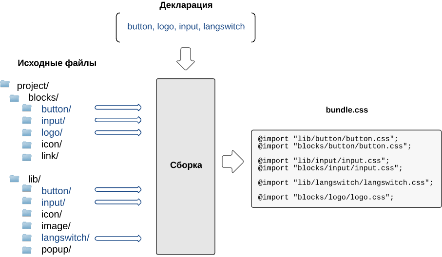
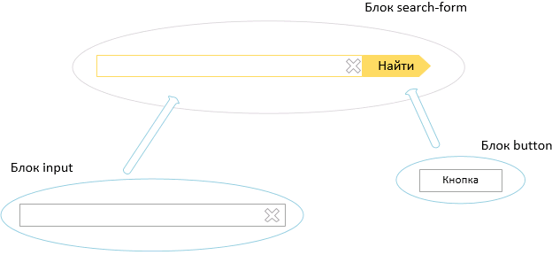

# Методологія складання БЕМ-проекту

Будь-який проект, побудований за БЕМ-методології, має розгалужену файлову структуру. Причина цього — компонентний підхід. [Блоки](../key-concepts/key-concepts.ru.md#Блок) у БЕМ можуть бути реалізовані в одній або декількох [технологіях](../key-concepts/key-concepts.ru.md#Технологія-реалізації). Кожна технологія знаходиться в окремому файлі. Як наслідок, щоб отримати з окремих файлів блоків загальні файли проекту, необхідно застосувати збірку. Для цього можна використовувати будь-який з існуючих [інструментів складання](#Інструменти для збірки).

Приклад організації файлової структури БЕМ-проекту:

```files
blocks/                 # Рівень проекту
    input/              # Директорія блоку `input`
        input.css       # Реалізація блоку `input` в технології CSS
        input.js        # Реалізація блоку `input` в технології JavaScript
    icon/
        icon.css

library/                # Рівень бібліотеки
    input/
        input.js        # Базова реалізація блоку `input` в технології JavaScript
    button/
```

> Докладніше про те, навіщо розділяти реалізацію блоку на окремі файли читайте в документі [Організація файлової структури БЕМ-проекту](../filesystem/filesystem.ru.md).

Збірка вирішує наступні завдання:
* об'єднує окремі [файли реалізацій](../filesystem/filesystem.ru.md#Реалізація-блоку-поділяється на окремі файли), розкладені по файловій структурі;
* підключає в проект тільки потрібні блоки, [елементи](../key-concepts/key-concepts.ru.md#Елемент) і [модифікатори](../key-concepts/key-concepts.ru.md#Модифікатор) з наявних у файловій структурі;
* враховує порядок підключення файлів в проект.

## Основні етапи складання

Щоб з окремих файлів отримати готову частину проекту (результат складання), наприклад, веб-сторінку, необхідно:

* [перерахувати блоки, елементи і модифікатори, які беруть участь у побудові сторінки](#Визначення списку-блоків-елементів-модифікаторів для створення сторінки)
* [вказати залежно використовуваних БЕМ-сутностей](#Пошук залежностей)
* [об'єднати вихідні файли](#Визначення порядку підключення-БЕМ-сутностей-в-складання)

### Результати складання

В результаті збірки можна отримати різні фінальні набори файлів:

* файли для окремої сторінки (наприклад, `hello.css` і `hello.js`);
* загальні файли для всього проекту (наприклад, один `project.css` і `project.js`);
* файли для фрагмента сторінки, такого як `шапка` або `підвал`, які використовуються на різних сторінках проекту (наприклад, `header.css` і `header.js`). Загальна частина збирається окремо і підключається при збірці.

Такі набори файлів, одержані в результаті складання, БЕМ-методології прийнято називати **бандлами**.

> Зверніть увагу, в документі збірка розглядається на прикладі **сторінки** — приватного випадку бандла.

У файловій структурі результати складання окремих файлів автоматично поміщаються в теку з назвою сторінки (наприклад, `hello`):

```files
blocks/                 # Директорія, що містить блоки

bundles/                # Директорія, що містить усі результати складання (опціонально)
    hello/              # Директорія сторінки `hello` (створюється вручну)
```

Приклад файлової структури БЕМ-проекту до виконання збірки:

```files
blocks/                 # Директорія, що містить блоки

bundles/                # Директорія, що містить усі результати складання
    hello/              # Директорія сторінки `hello`
        hello.decl.js   # Список БЕМ-сутностей, необхідних для сторінки `hello`
```

Приклад файлової структури БЕМ-проекту після виконання збірки:

```files
blocks/                 # Директорія, що містить блоки

bundles/                # Директорія, що містить усі результати складання
    hello/              # Директорія сторінки `hello`
        hello.decl.js   # Список БЕМ-сутностей, необхідних для сторінки `hello`
        hello.css       # Зібраний CSS-файл сторінки `hello`
        hello.js        # Зібраний JavaScript-файл сторінки `hello`
```

При зборці в проект можуть бути включені:

* всі БЕМ-суті з файлової структури (що значно збільшує обсяг результуючого коду);
* тільки необхідні для побудови сторінки БЕМ-сутності в строго визначеному порядку.

Для складання в проект тільки потрібних БЕМ-сутностей використовуються (опціонально):

* [Декларація](#Визначення списку-блоків-елементів-модифікаторів для створення сторінки) — визначає список БЕМ-сутностей, необхідних для створення сторінки.
* [Залежно](#Пошук залежностей) — визначають БЕМ-суті, необхідні для реалізації блоку.
* [Уровни переопределения](#Определение-порядка-подключения-БЭМ-сущностей-в-сборку) — определяют порядок подключения БЭМ-сущностей в сборку.

### Визначення списку блоків, елементів і модифікаторів для створення сторінки

Щоб почати збірку сторінки, інструмент збірки повинен дізнатися всі її складові.



Перший етап складання — формування списку необхідних БЕМ-сутностей. Розглянемо на прикладі, для чого і створюється такий список.

У проект підключена бібліотека, з якої на сторінці використовуються декілька блоків. Немає необхідності включати всю бібліотеку в збірку. Достатньо скласти список потрібного по опису сторінки. Це можна зробити автоматично і вручну. На підставі цього списку в збірку потраплять тільки перераховані блоки. У БЕМ-методології такий список зветься [декларацією](../declarations/declarations.ru.md).

Основне завдання декларації визначити, що і в якому порядку підключати в збірку.

> Докладніше про способи побудови декларації](../declarations/declarations.ru.md#Способи управління-деклараціями).

### Пошук залежностей

У БЕМ-методології багато блоки будуються на підставі інших блоків. Так, наприклад, блок форми пошуку`search-form`) побудований з допомогою блоків `input` (поле введення) і `button` (кнопка). Немає необхідності реалізовувати блок повторно, якщо він вже представлений в бібліотеці. Новий блок можна побудувати на основі існуючого.



Щоб створити блок з допомогою іншого, вже існуючого блоку, необхідно вказати залежності між ними. Так, наведений у прикладі блок `search-form` залежить від `input` і `button`.

Інструмент збірки отримує дані про залежності і додає всі сутності та технології, необхідні для реалізації блоку, в процесі складання. В залежностях також вказується порядок підключення сутностей.

Існує кілька способів вказати залежності:

* Безпосередньо в коді блоку.

  * В CSS залежності можна визначати за допомогою директиви [@import](http://htmlbook.ru/css/import).
  * В JavaScript можна декларувати залежності з допомогою модульної системи (наприклад, [AMD](https://github.com/amdjs/amdjs-api/wiki/AMD), [CommonJS](http://www.commonjs.org/) або импортов ([ECMAScript 2015](http://ecmascript.org)).

* В окремому файлі.

  > У БЕМ-платформі для вказівки залежностей використовується технологія [DEPS](https://ru.bem.info/technology/deps/).

  ```files
  blocks/
      input/
          input.css
          input.js
          input.deps.js   # Файл с зависимостями блока `input`
      button/
          button.css
          button.js
  ```

### Визначення порядку підключення БЕМ-сутностей в збірку

Порядок підключення БЕМ-сутностей в збірку залежить від:

* **зазначених залежностей**

  Залежності визначають, в якому порядку додаткова сутність повинна потрапити в збірку.

* **використовуваних рівнів перевизначення**

  Важливо дотримуватися порядок підключення [рівнів](../key-concepts/key-concepts.ru.md#Рівень-перевизначення) в збірку. Если сравнить уровни со слоями, то базовый слой – это исходная реализация блока, например, полученная из библиотеки, а каждый последующий слой накладывается сверху и дополняет (наследует) или изменяет базовую реализацию. Тому важливо, щоб в збірку спочатку потрапляла вихідна реалізація, а потім зміни зі всіх рівнів перевизначення.

На схеме показан принцип использования уровней переопределения при сборке: с уровня `common` подключаются общие компоненты для всех платформ, а с уровней `desktop` и `touch` — компоненты, специфичные для каждой из платформ.


Докладно про використання рівнів перевизначення читайте в прикладах:

* [Перевизначення блоків бібліотеки](../filesystem/filesystem.ru.md#Підключення бібліотеки)
* [Поділ проекту на платформи](../filesystem/filesystem.ru.md#Поділ проекту на-платформи)

## Інструменти для збірки

Вибір інструменту для збирання залежить від складності БЕМ-проекту, наявності в ньому рівнів перевизначення і використання залежностей.

БЕМ-методологія не обмежує вибір інструменту — можна використовувати будь-які збирачі (наприклад, Gulp, Grunt, Brunch, Broccoli), що відповідають вимогам вашого проекту.

> Приклад складання БЕМ-проекту за допомогою [Gulp](http://gulpjs.com/) — [Декларативний JavaScript по БЕМ](https://ru.bem.info/forum/-696/).

У БЕМ-платформі використовується складальник [ENB](https://ru.bem.info/tools/bem/enb-bem/), який підходить для складання БЕМ-проектів будь-якої складності.

> Приклад складання БЕМ-проекту за допомогою [ENB](https://ru.bem.info/tools/bem/enb-bem/) — [Створюємо свій проект на БЕМ](https://ru.bem.info/tutorials/start-with-project-stub/).
