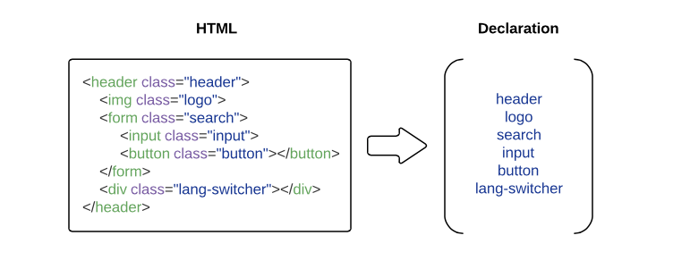
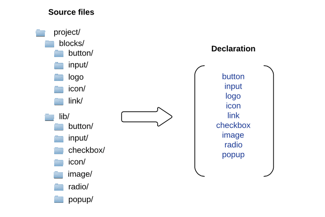

# Declarations in BEM

To list BEM entities needed to build a web page (effectively, ”an instance of a [bundle](../build/build.en.md#bundle)“), you can use a **declaration**.

A declaration is a list of [blocks](../key-concepts/key-concepts.en.md#block), [elements](../key-concepts/key-concepts.en.md#element), and [modifiers](../key-concepts/key-concepts.en.md#modifier) that are used on a page.. A build tool uses declaration data to narrow down a list of entities that end up in the final project. Rather than include all the blocks of the project, you can pick only the necessary ones from the list.

**The goal of a declaration** is to define what and in what order should be included in the build.

>In the BEM platform, a page description is created in BEMJSON format, and a page declaration is described in BEMDECL format, >e.g.:
>```js
>exports.blocks = [
>    { name: 'input' },
>    { name: 'button' },
>    { name: 'checkbox' }
>];
>```

## Ways of obtaining a declaration

You can form a declaration manually. To do this, list all the BEM entities involved in the creation of the page.

A declaration can be built automatically:

* [From the page description](#creating-a-declaration-from-the-page-description)
* [Via an introspection of the file structure](#creating-a-declaration-via-an-introspection-of-the-file-structure)

### Creating a declaration from the page description

A list of the entities to include in the build can be obtained using classes from the HTML file of the web page.

In a BEM project, the webpage structure is described by a [BEM tree](../key-concepts/key-concepts.en.md#bem-tree). This tree can be created manually, or generated automatically from classes in the HTML code (it contains classes with the names of all the [BEM entities](../key-concepts/key-concepts.en.md#bem-entity) used).

When the page get built, the declaration is formed automatically based on the BEM tree data:
* All entities (blocks, elements, and modifiers) are included in the declaration in the order specified in the build configuration.
* If the same entity is used twice on a page, it only occurs once in the declaration.
* The nesting of blocks and elements is not shown in the declaration.

>[html2bemjson](https://github.com/bem-incubator/html2bemjson) is one of the tools that builds a BEM tree out of the HTML structure of a page.



>For an example of a project where a separate declaration is formed for each individual page, see [Starting your own BEM project](https://en.bem.info/tutorials/start-with-project-stub/).

### Creating a declaration via an introspection of the file structure

Another source of information about the entities is the project file structure.
The declaration will thus encompass all entities that are found in the file structure of the project. Although it ensures a guaranteed inclusion of all the necessary entities in the build, this method is lacking in precision: the build will cover all of the existing entities, not just the relevant ones.
On the contrary, the page description-based declaration ensures the building of the relevant BEM entities on a per-entity basis, but does not guarantee inclusion of all those entities that are not explicitly specified in the HTML file for the page.



>In [bem-components](https://en.bem.info/libs/bem-components/), the method of creating a declaration via the introspection of a file structure is used for the [Dist](https://en.bem.info/libs/bem-components/)-based library distribution.

## Algebra of declarations

Declarations can help you manage the build process. For instance, you can combine different page declarations into one and build the entire project at once instead of page by page. In addition to combining declarations, you can reuse them, extract their common and different parts.

This kind of control enables you to assemble all pages into one [bundle](../build/build.en.md#bundle), load the necessary parts of a page on request or reuse already built common components on different pages.

### Operations with declarations

* [Addition](#adding-declarations) — uniting sets of entities from different declarations into one.
* [Subtraction](#subtracting-declarations) — getting the difference between sets of entities from different declarations.
* [Intersection](#intersecting-declarations) — obtaining a declaration from the intersection of sets of entities from two other declarations.

#### Adding declarations

Used for creating common technology files (e.g., a common CSS and JavaScript file) for multiple pages. Use it if you need to load all pages at once and save time loading each individual page when switching between the pages.

```text
Declaration 1       Declaration 2        Declaration 3

[                   [                    [
'header',           'header',            'header',
'input',            'input',             'input',
'button',           'button',            'button',
'link',                                  'link',
'attach',      +                  =      'attach',
                    'menu',              'menu',
'image',                                 'image',
                    'checkbox',          'checkbox',
'popup'                                  'popup',
                    'textarea'           'textarea'
]                   ]                    ]
```

#### Subtracting declarations

One of the ways to use it is for building a page part that is loaded on request (e.g., in response to a user action).

```text
Declaration 1       Declaration 2       Declaration 3

[                   [                   [
'button',           'button',
'checkbox',                             'checkbox',
'textarea',                             'textarea',
'suggest'                               'suggest'
                    'header',
             -      'input',      =
                    'menu',
                    'image',
                    'popup'
]                   ]                   ]
```

Let's say you have a page that uses a virtual keyboard that is only made available to the user in response to a certain action. Adding that block to the build for the entire page will only increase load time. The keys of the keyboard may already be implemented on the page for different purposes. The ability to subtract declarations allows you to create a separate bundle (files for a part of the page) for the missing implementation of the virtual keyboard and only connect it on request.

#### Intersecting declarations

Used for creating a declaration that describes common parts of different project pages. This lets you build a common part for all the pages and connect it once to all the pages during the build process.

```text
Declaration 1       Declaration 2       Declaration 3

[                   [                   [
'header',           'header',           'header',
'input',            'menu',
'link',        +    'button',      =
'attach',           'input',
'checkbox',         'image',
'textarea',         'popup',
'footer'            'footer'            'footer'
]                   ]                   ]
```
For example, such a separation can be effective if every page of the project features a `header` and a `footer`. The common part of the pages is described in a separate declaration. During the build process each page is then built on the basis of two declarations: the common one (containing the `header` and the `footer`) and its own (describing the remaining part of the page).
