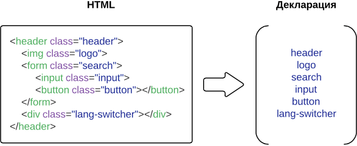
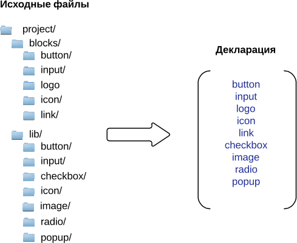

# Декларации в БЭМ

Чтобы перечислить БЭМ-сущности, необходимые для построения веб-страницы (читай «частного случая [бандла](../build/build.ru.md#bundle)»), можно воспользоваться **декларацией**.

Декларация представляет собой список [блоков](../key-concepts/key-concepts.ru.md#Блок), [элементов](../key-concepts/key-concepts.ru.md#Элемент) и [модификаторов](../key-concepts/key-concepts.ru.md#Модификатор), которые используются на странице. Таким образом, инструмент сборки, основываясь на данных из декларации, ограничивает количество сущностей, попадающих в готовый проект. Нет необходимости подключать все блоки проекта, если можно собрать только нужные по списку.

**Задача декларации** — определить, что и в каком порядке подключать в сборку.

>В БЭМ-платформе описание страницы создается в формате BEMJSON, а декларация страницы описывается в формате BEMDECL, например:
```js
exports.blocks = [
    { name: 'input' },
    { name: 'button' },
    { name: 'checkbox' }
];
```

## Способы получения декларации

Декларация может формироваться вручную. Для этого нужно перечислить БЭМ-сущности, участвующие в построении страницы.

Автоматическое построение декларации возможно:

* [по описанию страницы](#Создание-декларации-по-описанию-страницы)
* [с помощью интроспекции файловой структуры](#Создание-декларации-с-помощью-интроспекции-файловой-структуры)

### Создание декларации по описанию страницы

Список необходимых для сборки сущностей можно получить по классам из HTML-файла веб-страницы.

В БЭМ-проекте структура веб-страницы описывается с помощью [БЭМ-дерева](../key-concepts/key-concepts.ru.md#БЭМ-дерево). БЭМ-дерево, в свою очередь, может быть построено автоматически из HTML-кода (так как HTML-страница содержит все необходимые классы с именами всех используемых блоков, элементов и модификаторов) или может быть создано вручную.

При сборке страницы декларация формируется автоматически на основании данных из БЭМ-дерева:
* Все сущности (блоки, элементы и модификаторы) попадают в декларацию в порядке, указанном в конфигурации сборки.
* Если на странице используется одна и та же сущность дважды, в декларацию она попадет только один раз.
* Вложенность блоков и элементов в декларации не отображается.

>Один из инструментов, позволяющих получить БЭМ-дерево по HTML-структуре страницы, — [html2bemjson](https://github.com/bem-incubator/html2bemjson).



>Пример проекта, в котором формируется отдельная декларация для каждой страницы, — [Создаем свой проект на БЭМ](https://ru.bem.info/tutorials/start-with-project-stub/).

### Создание декларации с помощью интроспекции файловой структуры

Другой источник, откуда можно собрать данные о сущностях — файловая структура проекта.
Такой способ построения декларации автоматически включает все сущности, находящиеся в файловой структуры проекта. Это обеспечивает стопроцентное попадание в сборку всех необходимых сущностей, но не предоставляет точности: в сборку попадут все имеющиеся сущности, а не только нужные.
Декларация, созданная по описанию страницы, наоборот, обеспечивает точечную сборку нужных БЭМ-сущностей, но не может гарантировать подключение всех сущностей, явно не описанных в HTML-файле страницы.



>В [bem-components](https://ru.bem.info/libs/bem-components/) создание декларации с помощью интроспекции файловой структуры используется для поставки библиотеки в виде [Dist](https://ru.bem.info/libs/bem-components/current/#Варианты-поставки-библиотеки).

## Алгебра деклараций

С помощью деклараций можно управлять процессом сборки. Например, можно объединять декларации разных страниц в одну и собирать весь проект целиком, а не постранично. Декларации можно не только совмещать, но и повторно использовать, выделять общие части или различия.

Такое управление дает возможность собирать все страницы в один [бандл](../build/build.ru.md#bundle), догружать необходимые части страницы по требованию или повторно использовать уже собранные общие компоненты на разных страницах.

### Операции над декларациями

* [сложение](#Объединение-нескольких-деклараций-в-одну) — объединение множеств сущностей разных деклараций в одну;
* [вычитание](#Получение-разницы-между-декларациями) — получение разницы между множествами сущностей разных деклараций;
* [пересечение](#Получение-декларации-на-основе-пересечения-нескольких-других) — получение декларации на основании пересечения множеств сущностей двух других деклараций.

#### Сложение деклараций

Применяется для создания общих файлов технологий (например, общего CSS- и JavaScript-файла) для нескольких страниц. Используется, если необходимо загрузить все страницы одновременно и не тратить время на загрузку каждой отдельной страницы при переходе между ними.

```text
Декларация 1            Декларация 2            Декларация 3

[                       [                       [
    'header',               'header',               'header',
    'input',                'input',                'input',
    'button',               'button',               'button',
    'link',                                         'link',
    'attach',     +                        =        'attach',
                            'menu',                 'menu',
                            'image',                'image',
    'checkbox',                                     'checkbox',
                            'popup'                 'popup',
    'textarea'                                      'textarea'
]                       ]                       ]
```

#### Вычитание деклараций

Один из способов применения — сборка части страницы, которая догружается по требованию (например, в ответ на действие пользователя).

```text
Декларация 1            Декларация 2            Декларация 3

[                       [                       [
    'button',               'button',
    'checkbox',                                     'checkbox',
    'textarea',                                     'textarea',
    'suggest'                                       'suggest'
                            'header',
                    -       'input',       =
                            'button',
                            'menu',
                            'image',
                            'popup'
]                       ]                       ]
```

Например, на странице используется виртуальная клавиатура, которая становится доступна пользователю только в ответ на определенное действие. Нет необходимости включать этот блок в сборку всей страницы, так как это увеличит время загрузки. Кнопки клавиатуры могут быть уже реализованы на странице для других целей. Возможность вычитать декларации позволяет создать отдельный бандл (файлы для части страницы) для недостающей реализации виртуальной клавиатуры и подключать его только по требованию.

#### Пересечение деклараций

Применяется для создания декларации, описывающей общие части разных страниц проекта. Это позволяет собрать общую часть для всех страниц и подключать ее при сборке один раз ко всем страницам.

```text
Декларация 1            Декларация 2            Декларация 3

[                       [                       [
    'header',               'header',               'header',
    'input',                'menu',
    'link',        ⋂        'button',     =
    'attach',               'input',
    'checkbox',             'image',
    'textarea',             'popup',
    'footer'                'footer'                'footer'
]                        ]                       ]
```
Например, такое разделение эффективно, если в проекте на всех страницах используется `шапка` и `подвал`. Общая часть страниц описывается в отдельной декларации. При сборке каждая страница формируется на основании двух деклараций: общей (содержащей `шапку` и `подвал`) и собственной (описывающей оставшуюся часть страницы).
