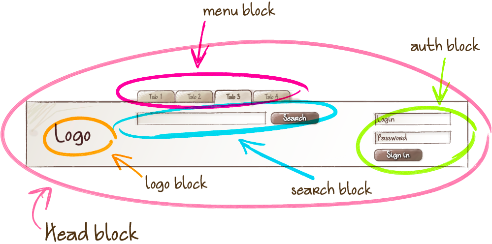
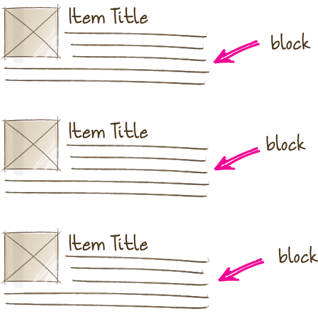
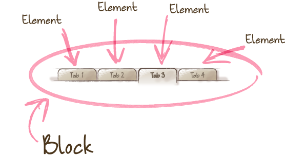
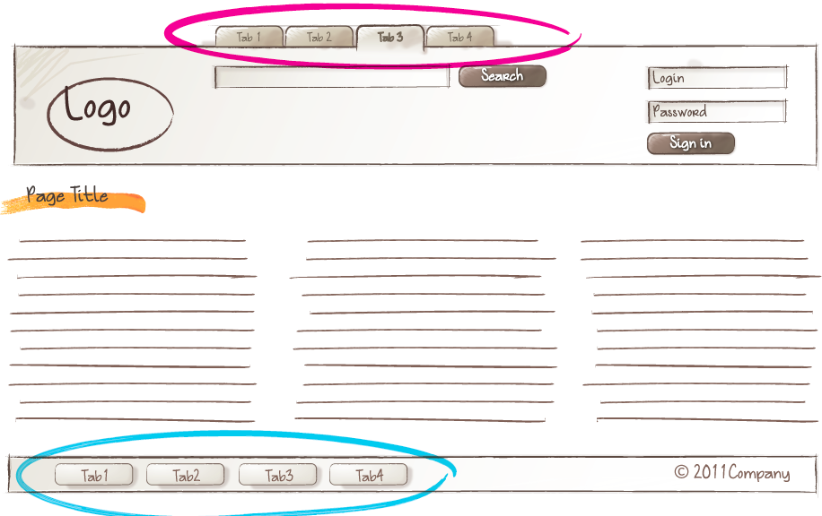
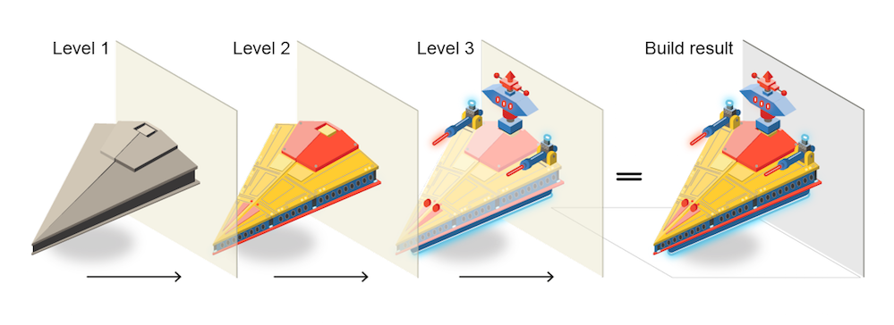

# Key concepts

* [Block](#block)
* [Element](#element)
* [Modifier](#modifier)
* [BEM entity](#bem-entity)
* [Mix](#mix)
* [BEM tree](#bem-tree)
* [Block implementation](#block-implementation)
* [Block implementation technology](#implementation-technology)
* [Block redefinition](#block-redefinition)
* [Redefinition level](#redefinition-level)

## Block

A logically and functionally independent page component, the equivalent of a component in Web Components. A block encapsulates behavior (JavaScript), templates, styles (CSS), and other [implementation technologies](#implementation-technology). Blocks being independent allows for their re-use, as well as facilitating the [project development and support process](../solved-problems/solved-problems.en.md).

### Block features

#### Nested structure

Blocks can be nested inside any other blocks.

For example, a `head` block can include a logo (`logo`), a search form (`search`), and an authorization block (`auth`).



#### Arbitrary placement

Blocks can be moved around on a page, moved between pages or projects. The implementation of blocks as independent entities makes it possible to change their position on the page and ensures their proper functioning and appearance.

Thus, the logo and the authorization form can be swapped around without modifying the CSS or JavaScript code of the blocks.


#### Re-use

An interface can contain multiple instances of the same block.



## Element

A constituent part of a [block](#block) that can't be used outside of it.

For example, a menu item is not used outside of the context of a menu block, therefore it is an element.



> [A block or an element: when should I use which?](../../faq/faq.en.md#a-block-or-an-element-which-one-should-i-create)
>
> [Using elements within elements is not recommended by the BEM methodology](../../faq/faq.en.md#why-not-create-elements-of-elements-block__elem1__elem2)

## Modifier

A BEM entity that defines the appearance and behavior of a [block](#block) or an [element](#element).

The use of modifiers is optional.

Modifiers are similar in essence to HTML attributes. The same block looks different due to the use of a modifier.

For instance, the appearance of the menu block (`menu`) may change depending on a modifier that is used on it.



Modifiers can be changed in runtime (for example, as a reaction to a DOM event of the block), or via other blocks.

For example, if the wrong credentials are entered when a user clicks the Sign In button (the 'click' DOM event), the 'visible' modifier is set on a hidden block with error messages.

## BEM entity

[Blocks](#block), [elements](#element), and [modifiers](#modifier) are all called BEM entities.

It is a notion that can be used both to refer to an individual BEM entity and as a generic term for blocks, elements, and modifiers.

## Mix

An instance of different [BEM entities](#bem-entity) being hosted on a single [DOM node](https://en.wikipedia.org/wiki/Document_Object_Model).

Mixes allow us to

* Combine the behaviors and styles of several BEM entities while avoiding code duplication.
* Create semantically new interface components on the basis of existing BEM entities.

Let's consider the case of a mix comprising a block and an element of another block.

Let's assume that links in your project are implemented via a `link` block. We need to format menu items as links. There are several ways to do that.

* Create a modifier for a menu item that turns the item into a link. Implementing such a modifier would necessarily involve copying the behavior and styles of the `link` block. That would result in code duplication.
* Have a mix combining a generic `link` block and a `link` element of a `menu` block. A mix of the two BEM entities will allow us to use the basic link functionality of the `link` block and additional CSS rules of the `menu` block without copying the code.

## BEM tree

A representation of a web page structure in terms of blocks, elements, and modifiers. It is an abstraction over a [DOM tree](https://en.wikipedia.org/wiki/Document_Object_Model) that describes the names of BEM entities, their states, order, nesting, and auxiliary data.

In real-life projects, a BEM tree can be presented in any format that supports the tree structure.

Let's consider an example of a DOM tree:

```html
<header class="header">
    
    <form class="search-form">
        <input class="input">
        <button class="button"></button>
    </form>
    <ul class="lang-switcher">
        <li class="lang-switcher__item">
            <a class="lang-switcher__link" href="url">en</a>
        </li>
        <li class="lang-switcher__item">
            <a class="lang-switcher__link" href="url">ru</a>
        </li>
    </ul>
</header>
```

The corresponding BEM tree will look like this:

```files
header
    logo
    search-form
        input
        button
    lang-switcher
        lang-switcher__item
            lang-switcher__link
        lang-switcher__item
            lang-switcher__link
```

In XML and [BEMJSON](https://github.com/bem/bem-xjst/blob/master/docs/en/4-data.md) formats, the same BEM tree will appear as follows:

XML

```xml
<block:header>
    <block:logo/>
    <block:search-form>
        <block:input/>
        <block:button/>
    </block:search-form>
    <block:lang-switcher>
        <elem:item>
            <elem:link/>
        </elem:item>
        <elem:item>
            <elem:link/>
        </elem:item>
    </block:lang-switcher>
</block:header>
```

BEMJSON

```js
{
    block: 'header',
    content : [
        { block : 'logo' },
        {
            block : 'search-form',
            content : [
                { block : 'input' },
                { block : 'button' }
            ]
        },
        {
            block : 'lang-switcher',
            content : [
                {
                    elem : 'item',
                    content : [
                        { elem : 'link' }
                    ]
                },
                {
                    elem : 'item',
                    content : [
                        { elem : 'link' }
                    ]
                }
            ]
        }
    ]
}
```

## Block implementation

A set of different [technologies](#implementation-technology) that determine the following aspects of a BEM entity:

* behavior
* appearance
* tests
* templates
* documentation
* description of dependencies
* additional data (e.g., images).

## Implementation technology

A technology used for [implementing](#block-implementation) a block.

Blocks can be implemented in one or more technologies, for example:

* behavior — JavaScript, CoffeeScript
* appearance — CSS, Stylus, Sass
* templates — BEMHTML, BH, Pug, Handlebars, XSL
* documentation — Markdown, Wiki, XML.

For instance, if the appearance of a block is defined with CSS, that means that the block is implemented in the CSS technology. Likewise, if the documentation for a block is written in Markdown format, the block is implemented in the Markdown technology.

## Block redefinition

Modifying a block [implementation](#block-implementation) by adding new features to the block on a different [level](#redefinition-level).

## Redefinition level

A set of BEM entities and their partial [implementations](#block-implementation).

The final implementation of a block can be divided into different redefinition levels. Each new level extends or overrides the original implementation of the block. The end result is assembled from individual [implementation technologies](#implementation-technology) of the block from all redefinition levels in a pre-determined consecutive order.



Any [implementation](#implementation-technology) technologies of BEM entities can be [redefined](#block-redefinition).

For example, there is a third-party library linked to a project on a separate level. The library contains ready-made block implementations. The project-specific blocks are stored on a different redefinition level.

Let's say we need to modify the appearance of one of the library blocks. That doesn't require changing the CSS rules of the block in the library source code or copying the code at the project level. We only need to create additional CSS rules for that block at the project level. During the build process, the resulting implementation will incorporate both the original rules from the library level and the new styles from the project level.
