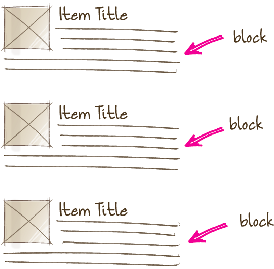

# Визначення

* [Блок](#Блок)
* [Елемент](#Елемент)
* [Модифікатор](#Модифікатор)
* [БЕМ-сутність](#БЕМ-сутність)
* [Мікс](#Мікс)
* [БЕМ-дерево](#БЕМ-дерево)
* [Реалізація блока](#Реалізація-блоку)
* [Технологія реалізації блока](#Технологія-реалізації)
* [Перевизначення блоку](#Перевизначення-блоку)
* [Рівень перевизначення](#Рівень-перевизначення)

## Блок

Логічно і функціонально незалежний компонент сторінки, аналог компонента в Web Components. Блок інкапсулює в собі поведінку (JavaScript), шаблони стилів (CSS) та інші [технології реалізації](#Технологія-реалізації). Незалежність блоків забезпечує можливість їх повторного використання, а також зручність в [розробці і підтримці проекту](../solved-problems/solved-problems.ru.md).

### Можливості блоків

#### Вкладена структура

Блоки можуть бути вкладені в інші блоки.

Наприклад, блок `head` може включати логотип (`logo`), форму пошуку`search`) і блок авторизації (`auth`).


#### Вільне переміщення

Блоки можна переміщати в межах однієї сторінки, сторінок або проектів. Незалежна реалізація блоку дозволяє змінювати його положення на сторінці і забезпечує коректну роботу і зовнішній вигляд.

Так, наприклад, логотип і форму авторизації можна поміняти місцями. При цьому вносити зміни в CSS та JavaScript-код блоку не потрібно.


#### Повторне використання

В інтерфейсі може одночасно бути кілька примірників одного і того ж блоку.



## Елемент

Складова частина [блоки](#Блок), яка не може використовуватися у відриві від нього.

Наприклад, пункт меню поза контекстом блоку меню не використовується, значить є елементом.


>[Коли створювати блок, коли елемент?](../../faq/faq.ru.md#У-будь-разі-створювати блок--якому--елемент)

>[Чому в методології БЕМ не рекомендується створювати елементи элементов?](../../faq/faq.ru.md#Почему-в-БЭМ-не-рекомендуется-создавать-элементы-элементов-block__elem1__elem2)

## Модифікатор

БЕМ-сутність, що визначає зовнішній вигляд, стан і поведінку [блоки](#Блок) або [елемента](#Елемент).

Використання модифікаторів опціонально.

По своїй суті модифікатори схожі атрибути HTML. Один і той же блок виглядає по-різному завдяки застосуванню модифікатора.

Наприклад, зовнішній вигляд блоку меню (`menu`) може змінюватися в залежності від застосованого модифікатора.


## БЕМ-сутність

БЕМ-називаються сутностями [блоки](#Блок), [елементи](#Елемент) і [модифікатори](#Модифікатор).

Це поняття може застосовуватися як приватне, якщо розглядається окрема БЕМ-сутність, і як збірне для блоків, елементів і модифікаторів. 

## Мікс

Спосіб використання різних [БЕМ-сутностей](#БЕМ-сутність) на одному [DOM-вузлі](https://ru.wikipedia.org/wiki/Document_Object_Model).

Мікси дозволяють:

* поєднувати поведінку і стилі декількох БЕМ-сутностей без дублювання коду;
* створювати семантично нові компоненти інтерфейсу на основі наявних БЕМ-сутностей.

Розглянемо приклад міксу блоку і елемента іншого блоку.

Припустимо, у проекті посилання реалізовані блоком `link`. Необхідно зробити посиланнями на пункти меню. Існує кілька способів:

* Створити модифікатор для пункту меню, який перетворить пункт у посилання. Но в таком случае для реализации модификатора придется скопировать поведение и стили блока `link`. Це призведе до дублювання коду.

* Воспользоваться миксом универсального блока `link` и элемента `link` блока `menu`. Мікс двох БЕМ-сутностей дозволить застосувати базову функціональність посилань з блоку `link` і додаткові CSS-правила з блоку `menu` без копіювання коду.

## БЕМ-дерево

Представлення структури веб-сторінки в термінах блоків, елементів і модифікаторів. Это абстракция над [DOM-деревом](https://ru.wikipedia.org/wiki/Document_Object_Model), которая описывает имена БЭМ-сущностей, их состояния, порядок, вложенность и вспомогательные данные.

У реальних проектах БЕМ-дерево можна виразити будь-якому форматі, який підтримує деревоподібну структуру.

Розглянемо приклад DOM-дерева:

```html
<header class="header">
    
    <form class="search-form">
        <input type="input">
        <button type="button"></button>
    </form>
    <div class="lang-switcher"></div>
</header>
```

Йому відповідає такий БЕМ-дерево:

```
header
    ├──logo
    └──search-form
        ├──input
        └──button
    └──lang-switcher
```

Це ж БЕМ-дерево буде мати наступний вигляд у форматах XML і [BEMJSON](https://ru.bem.info/technology/bemjson/):

XML

```xml
<block:header>
    <block:logo/>
    <block:search-form>
        <block:input/>
        <block:button/>
    </block:search-form>
    <block:lang-switcher/>
</block:header>
```

BEMJSON

```js
{
    block: 'header',
    content : [
        { block : 'logo' },
        {
            block : 'search-form',
            content : [
                { block : 'input' },
                { block : 'button' }
            ]
        },
        { block : 'lang-switcher' }
    ]
}
```

## Реалізація блоку

Набір різних [технологій](#Технологія-реалізації), що визначають такі особливості БЕМ-суті:

* поведінку;
* зовнішній вигляд;
* тести;
* шаблони;
* документацію;
* опис залежностей;
* додаткові дані (наприклад, картинки).

## Технологія реалізації

Технологія, яка використовується для [реалізацію](#Реалізація-блоку) блоку.

Блоки можуть бути реалізовані в одній або декількох технологіях, наприклад:

* поведінка — JavaScript, CoffeeScript;
* зовнішній вигляд — CSS, Stylus, Sass;
* шаблони — Jade, Handlebars, XSL, BEMHTML, BH;
* документація — Markdown, Wiki, XML.

Например, если внешний вид блока задан с помощью CSS, это означает, что блок реализован в технологии CSS. А если документация к блоку написана в формате Markdown — блок реализован в технологии Markdown.

## Перевизначення блоку

Зміна [реалізацію](#Реалізація-блоку) блоку шляхом додання йому нових особливостей на іншому [рівні](#Рівень-перевизначення).

## Рівень перевизначення

Набір БЕМ-сутностей і їх часткових [реалізацій](#Реалізація-блоку).

Кінцева реалізація блоку може бути поділена за різними рівнями перевизначення. Кожен наступний рівень додає або перекриває вихідну реалізацію блоку. Кінцевий результат збирається з окремих [технологій реалізації](#Технологія-реалізації) блоку з усіх рівнів перевизначення послідовно в заданому порядку.

[Ігнорувати](#Перевизначення-блоку) можна будь-які [технології реалізації](#Технологія-реалізації) БЕМ-сутностей.

Например, в проект на отдельный уровень подключается сторонняя библиотека, которая содержит готовые реализации блоков. Проектні блоки зберігаються на іншому рівні перевизначення.

Припустимо, що необхідно змінити зовнішній вигляд одного з блоків бібліотеки. Для цього не потрібно змінювати CSS-правила блоку у вихідному коді бібліотеки або копіювати код на рівень проекту. Досить створити додаткові CSS-правила для цього блоку на проектному рівні. При сборке в конечную реализацию подключатся исходные стили с уровня библиотеки и новые — с уровня проекта.
