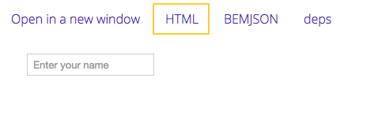
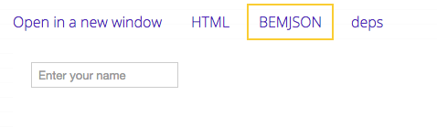

# Dist bem-components: подключаем блоки на страницу

## Описание урока

Один из [вариантов поставки](https://ru.bem.info/platform/libs/bem-components/6.0.0/#Использование) библиотеки [bem-components](https://ru.bem.info/platform/libs/bem-components/6.0.0/) — это предварительно собранные файлы ([бандлы](https://ru.bem.info/methodology/build/#Введение)), которые подключаются ссылками в HTML страницы. Это самый быстрый способ попробовать [блоки](https://ru.bem.info/methodology/key-concepts/#Блок) библиотеки в действии.

> **Важно!** Данный вариант поставки не позволяет использовать все преимущества БЭМ-проекта: [уровни переопределения](../../../method/key-concepts/key-concepts.ru.md#Уровень-переопределения), [миксы](../../../method/key-concepts/key-concepts.ru.md#Микс) и возможность [точечной сборки проекта](../../../method/build/build.ru.md#Определение-списка-БЭМ-сущностей). Для максимально эффективного использования библиотеки, воспользуйтесь поставками [source или compiled](https://ru.bem.info/platform/libs/bem-components/6.0.0/#source-compiled).

В этом уроке вы научитесь:
* [Подключать библиотеку в проект](#Подключение-библиотеки-в-проект)
* [Работать с блоками из библиотеки](#Работа-с-блоками)

Мы подключим блоки `button` и `input` из библиотеки в форму приветствия, как показано на рисунке ниже. В [результате](#Результат) получим форму, в которой имя пользователя при нажатии на кнопку отобразится в приветствии.


> [HTML-код](https://jsfiddle.net/inna__neige/jbrtwwcp/) страницы с формой приветствия.

Для работы с примерами необходимы:

* базовые навыки
  * HTML
  * CSS
  * JavaScript
  * БЭМ

* понимание технологий БЭМ
  * [i-bem.js](https://ru.bem.info/platform/i-bem/)
  * [BEMHTML](https://ru.bem.info/platform/bem-xjst/8/)

### Как выполнить урок

Есть несколько способов выполнить этот урок: вы можете писать код локально или использовать любую среду веб-разработки (например, [JSFiddle](https://jsfiddle.net), [CodePen](https://codepen.io/), [JS Bin](http://jsbin.com/?html,output)), которая позволяет редактировать и запускать код HTML, JavaScript и CSS.

> Все примеры выполнены в JSFiddle.

## Подключение библиотеки

Существует [несколько способов](https://ru.bem.info/platform/libs/bem-components/6.0.0/#Подключение-предсобранных-файлов-библиотеки-dist) получить предсобранные бандлы библиотеки. В документе рассмотрен способ подключения файлов с [CDN Яндекса](https://tech.yandex.ru/jslibs/).

Схема подключения файла с CDN: `//yastatic.net/название-библиотеки/версия/платформа/имя-файла`.

Чтобы подключить скрипты и стили библиотеки в проект, скопируйте ссылки на бандлы в теги `<link>` и `<script>`:

```diff
<!DOCTYPE html>
<html>
<head>
    <meta charset="utf-8">
    <title>bem-components as a library</title>
+   <link rel="stylesheet" href="https://yastatic.net/bem-components/latest/desktop/bem-components.css">
</head>
<body>
+   <script src="https://yastatic.net/bem-components/latest/desktop/bem-components.no-autoinit.js"></script>
</body>
</html>
```

> **Важно!** Библиотека содержит бандлы без [автоинициализации](https://ru.bem.info/platform/i-bem/init/) (`*.no-autoinit.js`), которые позволяют доопределять JavaScript-реализацию блоков библиотеки.

## Работа с блоками

Чтобы добавить блок на страницу, необходимо:

1. Выбрать блок  
  Зайдите в описание блока на сайте [bem.info](https://ru.bem.info/platform/libs/bem-components/6.0.0/) и выберите подходящий пример:  
    * [input](https://ru.bem.info/platform/libs/bem-components/6.0.0/touch-phone/input/#Модификатор-type-10)
    * [button](https://ru.bem.info/platform/libs/bem-components/6.0.0/touch-phone/button/#Кнопка-отправки-формы-модификатор-type-в-значении-submit-1)

2. Получить HTML-разметку выбранного блока  
  Воспользуйтесь примером из документации, чтобы получить HTML. HTML-код блока можно получить несколькими способами:  
    * [Использовать готовый HTML](#Использование-готового-html)  
        > Если новая версия библиотеки будет содержать шаблоны, которые изменят HTML-разметку, потребуется исправлять каждый блок вручную.
    * [Генерировать HTML в браузере](#Генерация-html-в-браузере)  
        > Если в новой версии библиотеки обновленные шаблоны изменят разметку, исправлять шаблоны вручную не потребуется. Но генерируемая в браузере разметка хуже индексируется поисковыми системами.

### Использование готового HTML

Чтобы получить готовую HTML-разметку блока, перейдите во вкладку `HTML` в примере блока:



Скопируйте код и вставьте на страницу:

```diff
<!DOCTYPE html>
<html>
<head>
    <meta charset="utf-8">
    <title>bem-components as a library</title>
    <link rel="stylesheet" href="https://yastatic.net/bem-components/latest/desktop/bem-components.css">
</head>
<body>
    <!-- Блок hello для создания формы приветствия -->
    <form class="hello i-bem" data-bem='{ "hello": {} }'>
        <div class="hello__greeting">Hello, %user name%!</div>
        <!-- HTML-код для блока input -->
+       <span class="input input_theme_islands input_size_m i-bem" data-bem='{"input":{}}'>
+           <span class="input__box">
+               <input class="input__control" placeholder="User name" autocomplete="off" autocorrect="off" autocapitalize="off" spellcheck="false">
+           </span>
+       </span>
        <!-- HTML-код для блока button -->
+       <button class="button button_theme_islands button_size_m button_type_submit button__control i-bem" data-bem='{"button":{}}' role="button" type="submit">
+           <span class="button__text">Click</span>
+       </button>
    </form>
    <script src="https://yastatic.net/bem-components/latest/desktop/bem-components.no-autoinit.js"></script>
</body>
</html>
```

Блоки `input` и `button` отобразились [на странице](https://jsfiddle.net/inna__neige/0hLmLmzn/6/). Чтобы имя из поля ввода появлялось в приветствии, опишите поведение блоков:

```javascript
modules.define('hello', ['i-bem-dom', 'input', 'button'],
    function(provide, bemDom, Input, Button) {

    provide(bemDom.declBlock('hello', {
        onSetMod: {
            js: {
                inited: function() {
                    this._input = this.findChildBlock(Input);
                }
            }
        },

        _onSubmit: function(e) {
            e.preventDefault();
            this._elem('greeting').domElem.text('Hello, ' + this._input.getVal() + '!');
        }
    }, {
        lazyInit: true,
        onInit: function() {
            this._domEvents().on('submit', this.prototype._onSubmit);
        }
    }));

});
// Вызов `init();`. Hеобходимо явно вызвать `init();`, чтобы инициализировать блоки, заранее присутствующие в HTML-разметке.
modules.require('i-bem-dom__init', function(init) { init(); });
```

Чтобы изменять поведение блоков, используется фреймворк [i-bem.js](https://ru.bem.info/platform/i-bem/), который является частью библиотеки [bem-core](https://ru.bem.info/platform/libs/bem-core/4.2.0/). Чтобы писать код на i-bem.js, дополнительно подключать на страницу предсобранные бандлы библиотеки `bem-core` не нужно, они уже включены в сборку.

Проект в [JSFiddle](https://jsfiddle.net/inna__neige/0hLmLmzn/).

### Генерация HTML в браузере

Чтобы генерировать HTML-разметку блока в браузере, необходимо использовать шаблонизатор [BEMHTML](https://ru.bem.info/platform/bem-xjst/8/), который преобразует [BEMJSON](https://ru.bem.info/platform/bemjson/) в HTML. Для этого [подключите](##Подключение-библиотеки-в-проект) бандл с шаблонизатором (`*.js+bemhtml.js`):

```diff
<!DOCTYPE html>
<html>
<head>
    <meta charset="utf-8">
    <title>bem-components as a library</title>
    <link rel="stylesheet" href="https://yastatic.net/bem-components/latest/desktop/bem-components.css">
</head>
<body class="page page_theme_islands">
    <!-- Блок hello для создания формы приветствия -->
    <form class="hello i-bem" data-bem='{ "hello": {} }'>
        <div class="hello__greeting">Hello, %user name%!</div>
    </form>
-   <script src="https://yastatic.net/bem-components/latest/desktop/bem-components.no-autoinit.js"></script>
+   <script src="https://yastatic.net/bem-components/latest/desktop/bem-components.no-autoinit.js+bemhtml.js"></script>
</body>
</html>
```

Чтобы получить `BEMJSON`-код блока, перейдите во вкладку `BEMJSON` в примере блока:



Скопируйте код и вставьте его в скрипт с шаблоном на страницу:

```diff
modules.define('hello', ['i-bem-dom', 'BEMHTML', 'input', 'button'],
    function(provide, bemDom, BEMHTML, Input, Button) {

    provide(bemDom.declBlock('hello', {
        onSetMod: {
            js: {
                inited: function() {
                    bemDom.append(this.domElem, BEMHTML.apply([ // Выполнение шаблона
+                       {
+                           block: 'input',
+                           mods: {
+                               theme: 'islands',
+                               size: 'm'
+                           },
+                           placeholder: 'User name'
+                       },
+                       {
+                           block: 'button',
+                           mods: {
+                               theme: 'islands',
+                               size: 'm',
+                               type: 'submit'
+                           },
+                           text: 'Click'
+                       }
                    ]));

                    this._input = this.findChildBlock(Input);
                }
            }
        },

        _onSubmit: function(e) {
            e.preventDefault();
            this._elem('greeting').domElem.text('Hello, ' + this._input.getVal() + '!');
        }
    }, {
        onInit: function() {
            this._domEvents().on('submit', this.prototype._onSubmit);
        }
    }));
});

// Вызов `init();`
modules.require('i-bem-dom__init', function(init) { init(); });
```

Проект в [JSFiddle](https://jsfiddle.net/inna__neige/df6uuw7u/).

## Результат

Форма приветствия готова. Чтобы она выглядела, как на рисунке в начале документа, добавьте блокам новые [стили](https://gist.github.com/innabelaya/dacca124dc486e7a3b0854752d9013e7).

**Не получилось?**

Если при создании формы возникли сложности, поищите решение на [форуме](https://ru.bem.info/forum/). Если готового ответа не нашлось, создайте пост со своим вопросом.
