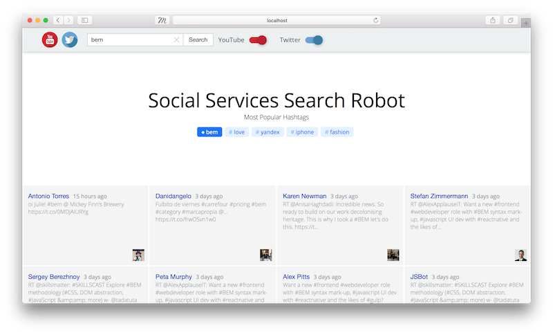

# Creating a dynamic BEM project

* [Introduction](#introduction)
* [Hello World application](#hello-world-application)
* [Social Services Search Robot application](#social-services-search-robot-application)
   * [Application flow](#application-flow)
   * [BEM technologies used](#bem-technologies-used)
   * [Project file structure](#the-projects-file-system)
   * [Creating the application](#creating-the-application)
   * [FAQ](#faq)

## Introduction

Many modern applications exchange data in online mode, partially or fully reloading the page afterwards.

This article explains how to develop BEM projects that deal with dynamic data.

We will cover how to create two applications:

* [Hello, World app](#hello-world-application) — A quick start for creating dynamic applications.
* [Social Services Search Robot](#social-services-search-robot-application) —  An application that searches for tweets and videos by keyword.

You will need:

* [Node.js 4+](https://nodejs.org).
* [Git](https://git-scm.com).
* [Git Bash](https://git-for-windows.github.io) (for Windows users).

> **Note:** This article will not look at layout and client JS issues.

## Hello World application

This is a dynamic application that outputs the words "Hello, World!" thus showing that it can launch and complete input/output operations.

Let's create this application and then extend it to the [Social Services Search Robot](#social-services-search-robot-application).

To create a Hello World application:

1. Clone the template repository [bem-express](https://github.com/bem/bem-express).

    ```bash
    git clone https://github.com/bem/bem-express.git bem-project
    ```

   > **Note:** This example uses `bem-express` 2.00.

2. Go to the project directory.

    ```bash
    cd bem-project
    ```

3. Delete the version history for the source repository.

    ```bash
    rm -rf .git
    ```

4. Initialize your own Git repository.

    ```bash
    git init
    ```

5. Set dependencies.

    ```bash
    npm install
    ```

6. Build the package and launch the server.

    ```bash
    npm run dev
    ```

    > **Note:** The project is built using [ENB](https://en.bem.info/toolbox/enb/).

    When the application is launched, the terminal shows a message that the server is running on port 3000:

    `Server is listening on 3000`.

    > **Note:** If port 3000 is busy, you can change it (for example, to 8000):
    >
    > ```bash
    > PORT=8000 npm run dev
    > ```

    The following is launched on your computer:

    * Server — Responsible for dynamic data processing.
    * [Nodemon](https://github.com/remy/nodemon/) — Tracks changes in the [file structure](https://en.bem.info/methodology/filestructure/) and restarts the server.
    * [Chokidar](https://github.com/paulmillr/chokidar) — Tracks changes in the **\*.blocks/** directories and rebuilds the project structure.
    * [Livereload](https://github.com/napcs/node-livereload) — Reloads the page in the browser.

7. Open the browser and enter the address: [localhost:3000](http://localhost:3000).

    The page that opens contains:

    ```text
    Index page content
    footer content
    ```

8. Open the file **server/index.js** and change the code starting from `app.get('/', function(req, res)`:

    ```diff
    // ...
    app.get('/', function(req, res) {
    +   var hello = 'Hello';
    +   var world = 'World';
        render(req, res, {
            view: 'page-index',
            title: 'Main page',
            meta: {
                description: 'Page description',
                og: {
                   url: 'https://site.com',
                   siteName: 'Site name'
                }
            },
    +       hello: hello,
    +       world: world
        })
    });
    // ...
    ```

9. Open the **common.blocks/page-index/page-index.bemtree.js** file and edit it:

    ```js
    block('page-index').content()(function() {
        // Getting the data from `this` global object
        var data = this.data;
        // Returning the received data: `data.hello: 'Hello'`, `data.world: 'World'`
        return data.hello + ', ' + data.world + '!';});
    ```

    After saving, the server reloads automatically, and the page content is changed to:

    ```text
    Hello, World!
    footer content
    ```

The Hello World application is ready.

> **Note:** If you had difficulties creating the application, search for a solution on the [forum](https://en.bem.info/forum/). If you can't find an answer, ask the experts in the forum.

## Social Services Search Robot application

This is a dynamic application that displays recent tweets and videos by keyword.

The purpose of this application is to show the relationship between:
* [BEM technologies](#bem-technologies-used).
* Data and interface in a BEM project.



### Application flow

The application flow can be visualized as follows:


1. The user sends a query to the server.
2. The application receives data from the [Twitter Search API](https://dev.twitter.com/rest/public/search) and [YouTube Data API](https://developers.google.com/youtube/v3/docs/search/list) that matches the user's query.
3. The application passes the data to the [BEMTREE template engine](#bemtree), which transforms the data to BEMJSON.
4. The application passes BEMJSON to the [BEMHTML template engine](#bemhtml), which transforms the BEMJSON to HTML.
5. The application returns the HTML page to the user.

### BEM technologies used

We will use the following technologies:

* [BEMDECL](#bemdecl) — Technology for describing declarations in BEM.
* [DEPS](#deps) — Technology for describing dependencies in BEM.
* [BEMTREE](#bemtree) — Template engine that transforms data to BEMJSON.
* [BEMHTML](#bemhtml) — Template engine that transforms BEMJSON to HTML.
* [i-bem.js](#i-bemjs) — JavaScript framework for BEM.

#### BEMDECL

Defines the list of [BEM entities](https://en.bem.info/methodology/key-concepts/#bem-entity) used on the page.

In BEM, this list is called a [declaration](https://en.bem.info/methodology/declarations/). The purpose of the declaration is to define what to include in the build and in what order.

Declarations are defined in files with the `.bemdecl.js` extension.

Example of a declaration from the [Hello World application](#hello-world-application):

```js
// The `desktop.bundles/index/index.bemdecl.js` file
exports.blocks = [
    { name: 'root' }
];
```

 As the example shows, the **index.bemdecl.js** file only defines the `root` block. This doesn't mean there are no other blocks on the page.  You should treat the `root` block as the central "entry point" for the compiler. Other BEM entities are included in the build by dependencies. In the [DEPS](#deps) technology, declarations define the block from which the [project build](https://en.bem.info/methodology/build/) starts.

This example shows how a project is built by dependencies (from the [Hello World application](#hello-world-application)):

```files
root(DECL)                      # The compiler searches for the index.bemdecl.js file
|
└──> root(DEPS)                 # The compiler searches for the root.deps.js file
     |
     └──> page(DEPS)            # The compiler searches for the page.deps.js file
          |
          ├──> header(DEPS)     # The compiler searches for the header.deps.js file
          |    |
          |    └──> ...
          |
          ├──> body(DEPS)       # The compiler searches for the body.deps.js file
          |    |
          |    └──> ...
          |
          └──> footer(DEPS)     # The compiler searches for the footer.deps.js file
               |
               └──> ...
```

> Learn more about the [BEMDECL technology](https://en.bem.info/methodology/declarations/).

#### DEPS

Defines dependencies between BEM entities that are spread out across the project's file system and not listed in the  [declarations](#bemdecl).

Dependencies are described as a JavaScript object in files with the `.deps.js` extension.

 Example of dependencies for the `root` block from the [Hello World application](#hello-world-application):

```js
// File `common.blocks/root/root.deps.js`
({
    shouldDeps: 'page'
})
```

> Learn more about the [DEPS technology](https://en.bem.info/platform/deps/).

#### BEMTREE

Part of the [bem-xjst](https://en.bem.info/platform/bem-xjst/) template engine that transforms data to BEMJSON.

 Templates are defined in BEMJSON format in files with the `.bemtree.js` extension.

Input and output of the template engine:


> Learn more about the [BEMTREE technology](https://en.bem.info/platform/bem-xjst/).

#### BEMHTML

Part of the [bem-xjst](https://en.bem.info/platform/bem-xjst/) template engine that transforms the BEMJSON description to HTML.

 Templates are defined in files with the `.bemhtml.js` extension.

Input and output of the template engine:


> Learn more about the [BEMHTML technology](https://en.bem.info/platform/bem-xjst/).

#### i-bem.js

The client JavaScript framework for web development using the BEM methodology.

 The JavaScript code is described in files with the `.js` extension.

It allows you to:

* Develop a web interface based on blocks, elements, and modifiers.
* Describe a block's logic in the declarative style, as a set of states.
* Easily integrate the JavaScript code with BEMHTML templates and CSS.
* Flexibly redefine the behavior of library blocks.

> Learn more about the [i-bem.js technology](https://en.bem.info/platform/i-bem/).

### The projects' file system

Looks like this:

```files
bem-project/
    .enb/                 # Config files for the ENB compiler
    common.blocks/        # Basic implementations of blocks
    desktop.bundles/      # Directories of project bundles
    development.blocks/   # Blocks that are integrated during development
    node_modules/         # Installed Node modules (packages)
    server/               # Directory with server code
    static/               # Root directory for distribution of static files
    .bemhint.js           # Bemhint linter configuration
    .borschik             # Borschik compiler configuration
    .eslintignore         # Excluding files and directories in ESLint
    .eslintrc             # ESLint configuration
    .gitignore            # Excluding files and directories in Git
    .stylelintrc          # Stylelint configuration
    .travis.yml           # Automatically starting linters in Continuous Integration
    nodemon.json          # Nodemon package configuration
    package.json          # Describing a project for npm
    README.md             # Text description of the project
```

### Creating the application

1. [Changing the project's file structure](#changing-the-projects-file-structure)
2. [Installing additional modules](#installing-additional-modules)
3. [Getting an OAuth token for Twitter](#getting-an-oauth-token-for-twitter)
4. [Getting an OAuth token for Google](#getting-an-oauth-token-for-google)
5. [Configuring the application](#configuring-the-application)
6. [Working with the Twitter Search API](#working-with-the-twitter-search-api)
7. [Working with the YouTube Data API](#working-with-the-youtube-data-api)
8. [Layout](#layout)

#### Changing the project's file structure

Before moving on to work with the Twitter Search API and the YouTube Data API, let's change the structure of the [Hello World application](#hello-world-application).

1. Create the following files and subdirectories in the **server** directory:

   ```diff
   server/
   +    controllers/         # Controllers
   +        index.js         # Controller for processing requests and rendering HTML
   +    helpers/             # Helpers
   +        index.js         # Entry point for helper modules (empty)
   +        twitter.js       # Helper module for working with the Twitter Search API (empty)
   +        youtube.js       # Helper module for working with the YouTube Data API (empty)
   +    middleware/          # Middleware modules
   +        auth.js          # Module for checking authentication on YouTube (empty)
   +    app.js               # Module for middleware integration
   +    auth.js              # Module for YouTube authentication (empty)
        config.js
        index.js
        rebuild.js
        render.js
   +    routes.js            # Module for routing the requests
   ```

   > **Note:** Files marked with the E (Empty) flag will be needed later.

2. Add [this code](https://gist.github.com/godfreyd/4bda7da3db029890378e15bcc38f32de) to the **controllers/index.js** file.
3. Add [this code](https://gist.github.com/godfreyd/a584cee1191833afae70fc059ba1f200) to the **app.js** file.
4. Add [this code](https://gist.github.com/godfreyd/f6de1c33a83dda708a0e3ba9312f0c78) to the **routes.js** file.
5. Replace the content of the **index.js** file with [this](https://gist.github.com/godfreyd/37d903c73f863619e2e1be1cd946d4c3).

   > **Note:** The `index.js` file should contain only the functionality for launching the application and listening for requests on the port.

When you complete all the steps, the [localhost:3000](http://localhost:3000) address should still show the page with the following content:

```text
Hello, World!
footer content
```

> **Note:** If your code doesn't work, look for typos.

#### Installing additional modules

To run the application, install the following modules:

* [express](http://expressjs.com) — Provides functionality for building web applications.
* [passport](http://passportjs.org) — Provides authentication strategies in Node.js applications.
* [passport-youtube-v3](https://www.npmjs.com/package/passport-youtube-v3) — Provides a Youtube authentication strategy using the Youtube account and [OAuth 2.0](https://oauth.net/2/) tokens.
* [twitter](https://www.npmjs.com/package/twitter) — Client library for working with the [Twitter REST API](https://dev.twitter.com/rest/public).
* [googleapis](http://google.github.io/google-api-nodejs-client/) — Client library for working with the [Google REST API](https://developers.google.com/apis-explorer/#p/).
* [moment](http://momentjs.com) — JavaScript library for syntax analysis, validation, and date formatting.

To install the modules, use the command:

```bash
$ npm install express passport passport-youtube-v3 twitter googleapis@^20.0.1 moment --save
```

#### Getting an OAuth token for Twitter

Twitter allows applications to make authenticated requests on behalf of the application itself. The API is accessed via the [OAuth 2.0](https://oauth.net) open authorization protocol.

To get an OAuth token:

1. Read the [documentation](https://dev.twitter.com/oauth).
2. Register the [application](https://apps.twitter.com).
3. Get the keys: Consumer Key and Consumer Secret.
4. [Encode the ](#how-do-i-encode-a-string-using-the-base64-method) `<Consumer Key>:<Consumer Secret>` string using [Base64](https://en.wikipedia.org/wiki/Base64).
5. [Get an OAuth token](#gettoken).

Use the token and keys you got in requests you send to the Twitter Search API. Learn more in [Working with the Twitter Search API](#working-with-the-twitter-search-api).

> **Important:** Save the token and keys you received: Consumer Key and Consumer Secret. You will need them for the application [configuration file](#configuring-the-application).

#### Getting an OAuth token for Google

Google allows applications to make authenticated requests on behalf of the application itself. The API is accessed via the [OAuth 2.0](https://oauth.net) open authorization protocol.

> **Note:** The [passport-youtube-v3](#passport-youtube-v3) module is responsible for receiving and updating the OAuth token in exchange for the authorization code using a POST request.

To get an OAuth token:

1. Read the [documentation](https://dev.twitter.com/oauth).
2. Register the [application](https://console.developers.google.com/) and get a Client ID and Client Secret.
3. Set the callback URL (in our case it is  `http://localhost:3000`) in your application's account.

Use the Client ID and Client Secret you got in the requests you send to the YouTube Data API. Learn more in [Working with the YouTube Data API](#working-with-the-youtube-data-api).

> **Important:** Save the keys you received: Client ID and Client Secret. You will need them for the application [configuration file](#configuring-the-application).

#### Configuring the application

1. Add the `services` field in the **server/config.js** file.

   ```diff
   module.exports = {
       staticFolder: 'static',
       defaultPort: 3000,
       cacheTTL: 30000,
       sessionSecret: 'REPLACE_ME_WITH_RANDOM_STRING',
   +   services: {
   +       twitter: {
   +           consumer_key: '*****',
   +           consumer_secret: '*****',
   +           bearer_token: '*****'
   +        },
   +        youtube: {
   +           client_id: '*****',
   +           client_secret: '*****',
   +           redirect_url: 'http://localhost:3000'
   +        }
   +    }
   };
   ```

2. Replace asterisks with the received keys and tokens.
3. Hide the **server/config.json** file from the Git version control system so you don't accidentally add private keys to the file repository.

   ```bash
   # файл .gitignore
   server/config.js
   ```

#### Working with the Twitter Search API

[The Twitter Search API](https://dev.twitter.com/rest/public/search) lets you find tweets published over the last 7 days.

To configure the application for interacting with the API:

1. Open the **controllers/index.js** file and replace its content with [this](https://gist.github.com/godfreyd/3420597de46509b02c69707d596c8dc4).
2. Add the following code in the **helpers/index.js** file:

   ```js
   module.exports = {
       twitter: require('./twitter')
   };
   ```

3. Add [this code](https://gist.github.com/godfreyd/e48b6831d785e51ee6ce0892151e3395) in the **helpers/twitter.js** file.

#### Working with the YouTube Data API

[The YouTube Data API](https://developers.google.com/youtube/v3/) lets you search videos by keyword.

To configure the application for interacting with the API:

1. Add [this code](https://gist.github.com/godfreyd/68af82df0bc171da54971990f442dddb) in the **server/auth.js** file.
2. Edit the **server/routes.js** file:

   ```diff
   var router = require('express').Router(),
       controllers = require('./controllers'),
   +   passportYouTube = require('./auth'),
   +   middleware = require('./middleware/auth'),
   +   isAuthenticated = middleware.isAuthenticated;

       router
   -       .get('/ping/', function(req, res) {
   -           res.send('ok');
   -       })
   -       .get('/', controllers.getContent);
   +       .get('/auth/youtube', passportYouTube.authenticate('youtube'))
   +       .get('/auth/youtube/callback', passportYouTube.authenticate('youtube',
   +           {failureRedirect: '/error', failureFlash: true }), (req, res) => {
   +               res.redirect('/');
   +           })
   +       .get('/', isAuthenticated, controllers.getContent);

       module.exports = router;
   ```

3. Replace the content of the **controllers/index.js** file with [this](https://gist.github.com/godfreyd/60d5d123c45c067b3fb675688dc74835).
4. Edit the **helpers/index.js** file:

   ```diff
   module.exports = {
       twitter: require('./twitter'),
   +   youtube: require('./youtube')
   };
   ```

5. Add [this code](https://gist.github.com/godfreyd/e103013e1fe480965cd84b3e7040d04b) in the **helpers/youtube.js** file.
6. Add the following content in the **middleware/auth.js** file:

   ```js
   module.exports = {
       isAuthenticated: function(req, res, next) {
           if (req.isAuthenticated()) return next();
           return res.redirect('/auth/youtube');
       }
   };
   ```

#### Layout

This article doesn't cover layout and the JavaScript client. Describing layout issues would make this document unreasonably large and difficult to use.

To prepare the layout, follow these steps:

1. Delete all the blocks from the **common.blocks** directory.
2. Clone [these blocks](https://github.com/godfreyd/bem-in-dynamic/tree/master/common.blocks) to the **common.blocks** directory.
3. Add [logo.svg](https://github.com/godfreyd/bem-in-dynamic/blob/master/static/images/logo.svg) in the **static** directory.
4. Restart the server: `npm run dev`.

Social Services Search Robot application is ready.

> **Note:** If you had difficulties creating the application, search for a solution on the [forum](https://en.bem.info/forum/). If you can't find an answer, ask the experts in the forum.

### FAQ

* [How do I encode a string using the Base64 method?](#how-do-i-encode-a-string-using-the-base64-method)
* [How do I get an OAuth token?](#how-do-i-get-an-oauth-token)

#### How do I encode a string using the Base64 method?

To encode a string:

1. Create a string in the format: `<Consumer Key>:<Consumer Secret>`.

   **Example**

   `xvz1evFS4wEEPTGEFPHBog:L8qq9PZyRg6ieKGEKhZolGC0vJWLw8iEJ88DRdyOg`

   > **Note:** To get the Consumer Key and Consumer Secret, go to **Keys and Access Tokens** [for your application](https://apps.twitter.com).

2. Start a terminal or Git Bash (for Windows users).
3. Run the command `echo -n "xvz1evFS4wEEPTGEFPHBog:L8qq9PZyRg6ieKGEKhZolGC0vJWLw8iEJ88DRdyOg" | base64`.
4. Copy the code you get.

   **Example**

   `eHZ6MWV2RlM0d0VFUFRHRUZQSEdFS2hab2xHQzB2SldMdzhpRUo4OERSZHlPZw==`

> **Note:** If you have any difficulties, use the online resource [base64encode.org](https://www.base64encode.org).

#### How do I get an OAuth token?

To get the token:

1. Install and run [Postman](https://www.getpostman.com).

2. Choose the **POST** request type.
3. Enter the server address (for Twitter — `https://api.twitter.com/oauth2/token`).
4. Go to the **Headers** tab.
5. Add the `Authorization` and `Content-Type` headers with the corresponding values.

   | Key | Value |
   | --- | ----- |
   | Authorization | Basic <the encoded Consumer Key:Consumer Secret string> |
   | Content-Type | application/x-www-form-urlencoded;charset=UTF-8 |

   > **Note:** Basic indicates the basic authorization method.

6. Go to the **Body** tab → Choose the `x-www-form-urlencoded` option.
7. Enter the `grant_type` request body with the `client_credentials` value in the **Key** field.
8. Click the **Send** button.

The OAuth server returns the token in JSON format:

```json
{
    "token_type": "bearer",
    "access_token": "AAAAAAAAAAAAAAAAAAAAAA%2FAAAAAAAAAA%3DAAAAAAAAAAAAAAAAAA"
}
```

> **Important:** Save the token you received for the [configuration file](#configuring-the-application).

